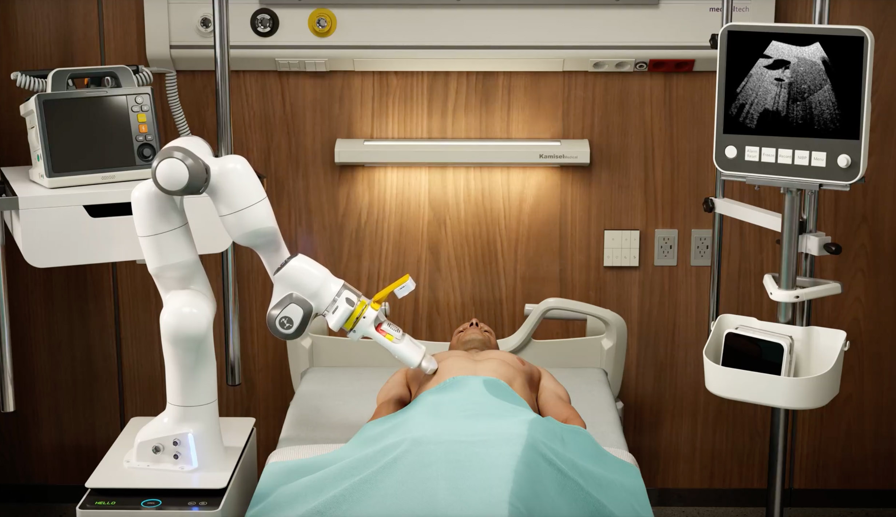
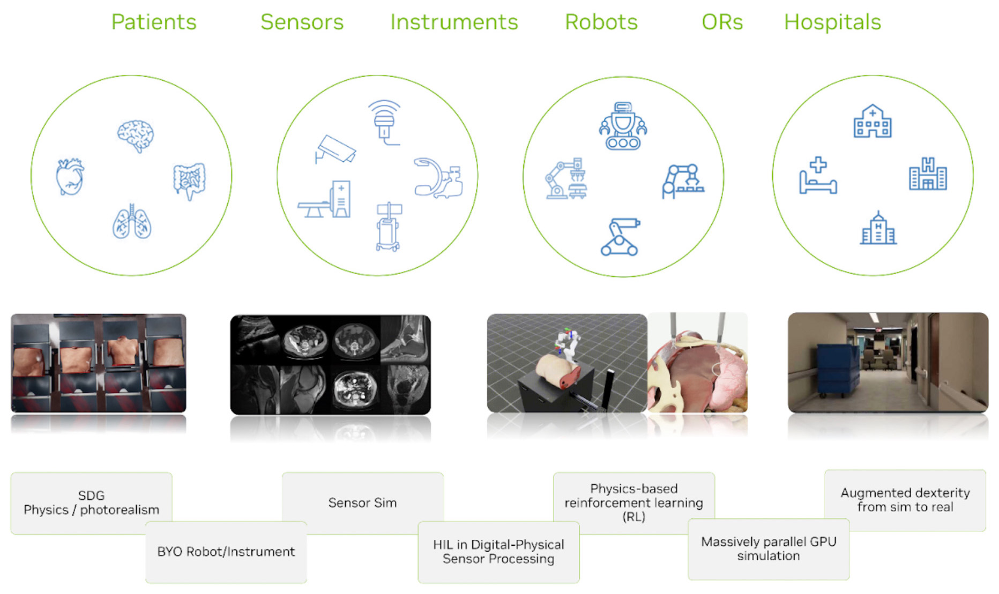

<p align="center" style="display: flex; justify-content: center; gap: 10px;">
  
  
</p>

# Isaac for Healthcare - Workflows

[](https://docs.isaacsim.omniverse.nvidia.com/4.2.0/index.html)
[](https://docs.python.org/3/whatsnew/3.10.html)
[](https://releases.ubuntu.com/20.04/)
[](https://opensource.org/license/apache-2-0)

**[Nvidia Isaac for Healthcare](https://github.com/isaac-for-healthcare)** is the 3-computer solution for healthcare robotics.

Isaac for Healthcare enables healthcare technology developers to leverage **NVIDIA technologies** to:
- Accelerate development and testing of AI algorithms with synthetic data generated in digital twin.
- Accelerate development, training and testing of robotic policies in digital twin environments.
- Enable development, training and testing of systems with hardware-in-the-loop (HIL).
- Seamlessly transition from simulation to physical systems (Sim2Real).

## Key Features



**Isaac for Healthcare Workflows** will bring the combined power of digital twins and physical AI for:
- **Digital prototyping** of next-gen healthcare robotic systems, sensors and instruments.
- **Training AI models** with synthetic data generation (SDG) augmented with real data.
- **Evaluating AI models** in digital twin environment with HIL.
- **Collecting data for training robotic policies** through imitation learning, by enabling XR and/or haptics enabled teleoperation of robotic systems in digital twin.
- **Training robotic policies** for augmented dexterity (e.g., in robot-assisted surgery). Leveraging GPU parallelization to train reinforcement and imitation learning algorithms.
- **Continuous testing (CT) of robotic systems** through HIL digital twin systems.
- **Deploying robotic policies** for Sim2Real deployment on Nvidia Holoscan.
- **Creating interactive training** experience for clinicians/users (pre-op planning, post-op evaluations/insights).

## Getting Started

For everything you need to get started, including detailed tutorials and step-by-step guides, follow these links to learn more about:

- Workflows
  - [Robotic ultrasound](./workflows/robotic_ultrasound/README.md)
  - [Robotic surgery](./workflows/robotic_surgery/README.md)
- Tutorials
  - [Bring your own patient](./tutorials/assets/bring_your_own_patient/README.md)
  - [Bring your own robot](./tutorials/assets/bring_your_own_robot/README.md)

## Contributing to i4h-workflows

We wholeheartedly welcome contributions from the community to make this framework mature and useful for everyone.
These may happen as bug reports, feature requests, or code contributions. For details, please check our
[contribution guidelines](./CONTRIBUTING.md).

## Troubleshooting & Support

Please [submit an issue](https://github.com/isaac-for-healthcare/i4h-workflows/issues) to request and enhancement, bug fix, or other change in Isaac for Healthcare Workflows.

## License

The Isaac for Healthcare framework is under [Apache 2.0](./LICENSE).

## Acknowledgement

The [Robotic Surgery workflow](./workflows/robotic_surgery/) initiated from the [ORBIT-Surgical](https://orbit-surgical.github.io/) framework. We would appreciate if you would cite it in academic publications as well:

```
@inproceedings{ORBIT-Surgical,
  author={Yu, Qinxi and Moghani, Masoud and Dharmarajan, Karthik and Schorp, Vincent and Panitch, William Chung-Ho and Liu, Jingzhou and Hari, Kush and Huang, Huang and Mittal, Mayank and Goldberg, Ken and Garg, Animesh},
  booktitle={2024 IEEE International Conference on Robotics and Automation (ICRA)},
  title={ORBIT-Surgical: An Open-Simulation Framework for Learning Surgical Augmented Dexterity},
  year={2024},
  pages={15509-15516},
  doi={10.1109/ICRA57147.2024.10611637}
}

@inproceedings{SuFIA-BC,
  author={Moghani, Masoud and Nelson, Nigel and Ghanem, Mohamed and Diaz-Pinto, Andres and Hari, Kush and Azizian, Mahdi and Goldberg, Ken and Huver, Sean and Garg, Animesh},
  booktitle={2025 IEEE International Conference on Robotics and Automation (ICRA)},
  title={SuFIA-BC: Generating High Quality Demonstration Data for Visuomotor Policy Learning in Surgical Subtasks},
  year={2025},
}
```
