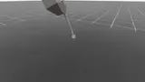
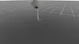
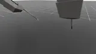
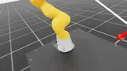
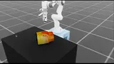
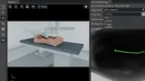
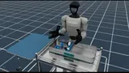
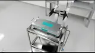
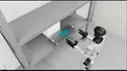
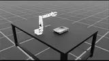

# Isaac for Healthcare - Workflows

[](https://docs.isaacsim.omniverse.nvidia.com/6.0.0/index.html)
[](https://docs.python.org/3/)
[](LICENSE)
[](https://github.com/isaac-for-healthcare/i4h-workflows/actions/workflows/pre-commit.yml)

IsaacLab-Arena simulation for healthcare robotics, with one workflow-based runtime for task execution, data collection, and policy evaluation.

A Scene describes the simulated world. A Workflow connects that Scene to the Tasks needed for a healthcare robotics procedure. The Engine runs those Tasks in the simulator.

## Layout

The repository has seven main components:

- `common/` — shared data contracts and recording formats
- `arena/` — Isaac Sim scenes and runtime
- `tasks/` — reusable robot behaviors and policy integrations
- `rl/` — reinforcement learning profiles
- `workflows/` — workflow definitions organized in the [workflow layout and specialty catalog](workflows/README.md)
- `engine/` — task graph execution and workflow validation
- `tools/` — dataset processing and visualization tools

See [DESIGN.md](DESIGN.md) for detailed architecture and ownership rules.

## Requirements

- Ubuntu 22.04 or 24.04 on `x86_64` or `aarch64`
- RTX-capable NVIDIA GPU with 16 GB VRAM minimum for Isaac Sim; 48 GB recommended for i4h workflows
- Linux driver `580.95.05` (the Isaac Sim 6.0 tested version) or a compatible newer production-branch driver
- Some training profiles require more VRAM or multiple GPUs; see the workflow-specific documentation
- `uv` and `git`
- Network access for Python packages, third-party checkouts, models, and assets
- Tens of GB for dependencies, plus additional model-cache space (large checkpoints such as GR00T N1.7 can require several dozen GB)
- Optional for natural-language prompts: Claude Code, Codex, or the repository's [Local Agent](local-agent/README.md). Tested with Opus 4.8 (1M context) and GPT-5.5 at low or medium reasoning effort.

## Supported Workflows

Workflows are organized by clinical robotics specialty. The specialty affects source layout only; workflow IDs and `run.sh` commands remain unchanged.

`✓` means available, `—` means unavailable, and “RL training required” means you must train and export a policy first.

### [Laparoscopic Robotics](workflows/i4h_workflows/laparoscopic-robotics/README.md)

| Preview | Workflow | Purpose | Robot | Policy readiness | Rule-based |
| --- | --- | --- | --- | --- | --- |
|  | [`surgical_lift_block`](workflows/i4h_workflows/laparoscopic-robotics/README.md) | Grasp and lift a peg-transfer block. | dVRK PSM | — | ✓ |
|  | [`surgical_lift_needle`](workflows/i4h_workflows/laparoscopic-robotics/README.md) | Grasp and lift a suture needle. | dVRK PSM | — | ✓ |
|  | [`surgical_lift_needle_organs`](workflows/i4h_workflows/laparoscopic-robotics/README.md) | Lift a suture needle from an organ bed. | dVRK PSM | — | ✓ |
|  | [`surgical_reach_dual_psm`](workflows/i4h_workflows/laparoscopic-robotics/README.md) | Reach two targets with two arms. | dual dVRK PSM | — | ✓ |
|  | [`surgical_reach_psm`](workflows/i4h_workflows/laparoscopic-robotics/README.md) | Reach a target with one PSM arm. | dVRK PSM | — | ✓ |
|  | [`surgical_reach_star`](workflows/i4h_workflows/laparoscopic-robotics/README.md) | Reach a target with a STAR arm. | STAR | — | ✓ |

### [Ultrasound Robotics](workflows/i4h_workflows/ultrasound-robotics/README.md)

| Preview | Workflow | Purpose | Robot | Policy readiness | Rule-based |
| --- | --- | --- | --- | --- | --- |
|  | [`ultrasound_liver_scan`](workflows/i4h_workflows/ultrasound-robotics/README.md) | Sweep an ultrasound probe across an abdominal phantom. | Franka-style arm | ✓ openpi PI0 | ✓ |
|  | [`ultrasound_probe_reach`](workflows/i4h_workflows/ultrasound-robotics/README.md) | Align a probe with a randomized target. | Franka-style arm | RL training required | — |

### [Endoluminal Robotics](workflows/i4h_workflows/endoluminal-robotics/README.md)

| Preview | Workflow | Purpose | Robot | Policy readiness | Rule-based |
| --- | --- | --- | --- | --- | --- |
|  | [`endoluminal_navigation`](workflows/i4h_workflows/endoluminal-robotics/README.md) | Navigate a catheter with live fluoroscopy in `demo` mode. | XPBD catheter + orbital C-arm | — | — |

### [Hospital Automation Robotics](workflows/i4h_workflows/hospital-automation-robotics/README.md)

| Preview | Workflow | Purpose | Robot | Policy readiness | Rule-based |
| --- | --- | --- | --- | --- | --- |
|  | [`assemble_trocar`](workflows/i4h_workflows/hospital-automation-robotics/README.md) | Assemble and place a trocar. | Unitree G1 + dex hands | ✓ GR00T N1.5 | — |
|  | [`locomanip_push_cart`](workflows/i4h_workflows/hospital-automation-robotics/README.md) | Walk to and push a cart. | Unitree G1 | ✓ GR00T N1.6 | — |
|  | [`locomanip_tray_pick_and_place`](workflows/i4h_workflows/hospital-automation-robotics/README.md) | Move a surgical tray from a shelf to a cart. | Unitree G1 | ✓ GR00T N1.6 | — |
|  | [`scissor_pick_and_place`](workflows/i4h_workflows/hospital-automation-robotics/README.md) | Pick up scissors and place them in a tray. | SO-ARM 101 | ✓ GR00T N1.5 / N1.7 | ✓ |

PhysX is the default physics backend for all workflows. The laparoscopic workflows also support Newton physics. `assemble_trocar` also provides an RLinf PPO post-training profile.

## Use with an AI Agent

Use this interface with Claude Code, Codex, or the repository's [Local Agent](local-agent/README.md). Describe the outcome you want; the agent selects the appropriate repository skill, resolves the direct commands, performs the work, and reports validation evidence. Setup, execution, authoring, and the data-to-policy pipeline can all be requested through prompts.

### Setup with an AI Agent

```text
What does the i4h workflow include, and where should I start?
Set up the i4h workflow on this machine and tell me if any host requirements are missing.
```

The agent checks host requirements, installs or repairs the repository dependencies, and reports anything that still blocks execution.

### Run Workflows with an AI Agent

Choose this path when one of the supported workflows already matches the robot, scene, and task you want to run. Give each prompt separately so follow-up requests such as replay and annotation can use recordings produced by the preceding evaluation.

```text
Evaluate scissor pick and place in policy mode and record 2 successful episodes.
Replay the second episode.
Run annotation on all recorded episodes and summarize.

Evaluate ultrasound_liver_scan in policy mode for 1 episode.
Evaluate trocar assembly in policy mode for 1 episode.
Evaluate locomanip tray pick and place in policy mode for 1 episode.
Evaluate locomanip push cart in policy mode for 1 episode.

Run surgical_reach_psm in rule-based mode for 1 episode.
Run surgical_reach_psm in rule-based mode for 1 episode with Newton physics.
Run surgical_lift_needle in rule-based mode for 1 episode.
```

### Author New Workflow with an AI Agent

Start with an empty Scene, then add reusable Task behavior, define the Workflow goal, and expose the run modes you need.

```text
create a new workflow with an empty scene
          ↓
edit the scene: add assets, robot, cameras, layout, physics
          ↓
add reusable task behavior
          ↓
define the workflow goal + success condition
          ↓
add run modes: rule-based, teleop, replay, policy
          ↓
validate each enabled mode
```

A Scene owns the simulated world. A Task owns one reusable behavior. A Workflow selects the Scene and Tasks, exposes run modes, and defines the goal and success condition.

Issue the following prompts in order. Each prompt completes one ownership boundary before the next stage depends on it:

```text
Create a blank hospital-automation-robotics workflow named my_workflow.

Edit my_workflow live.
  - Add a surgical table.
  - Add scissors and tweezers on the table.
  - Add two destination trays named tray_a and tray_b.
  - Add a Unitree G1 robot.
  - Move G1 so its base starts 2 m from the nearest table edge.
  - Keep G1 upright and facing the center of the table.
  - Set the perspective view to frame the room, then add a room camera from that view.
  - Visually verify that the tabletop, scissors, tweezers, and both trays are visible in at least one camera.
  - Bake all changes and stop.

Continue authoring my_workflow with a rule-based G1 reach-table Task.
  - Behavior: have G1 walk forward and stop near the surgical table.

Define the goal and success condition for my_workflow.
  - Goal: G1 reaches the surgical table.
  - Success: G1 stops upright within 0.3 m of the nearest table edge.

Add these run modes to my_workflow:
  - rule-based
  - trainable GR00T N1.6 policy
Validate the rule-based rollout and statically validate all modes.

Run and record 5 successful rule-based episodes for my_workflow.
Convert and visualize the recorded data.
Fine-tune for 200 steps with a batch size of 32. Turn off vision tuning.
Evaluate the new checkpoint.
Stop all
```

### Author New Workflow with an RL Policy using an AI Agent

Online RL is a separate training lifecycle. It trains a policy against a Workflow's Scene, then returns the verified checkpoint to the Workflow for normal policy validation.

```text
create a blank Workflow
          ↓
author and validate its Scene
          ↓
define the RL objective: observations + actions + rewards + success + resets
          ↓
train from scratch or RL post-train a pretrained policy
          ↓
evaluate the policy in vectorized simulation
          ↓
export the trained checkpoint and create its reusable policy Task
          ↓
add the Task to the Workflow's policy TaskGraph
          ↓
validate the complete Workflow through the normal runner
```

Issue these prompts in order:

```text
Create a blank ultrasound-robotics workflow named robotic_instrument_reach.

Edit robotic_instrument_reach live.
  - Add a table and a surgical training pad.
  - Add a Franka-style arm with a probe attached to its tool frame.
  - Add a target marker on the pad and a room camera.
  - Frame the arm, probe, pad, and target in the camera view.
  - Visually verify that the arm, probe, pad, and target are visible in the room camera.
  - Bake all changes and stop.

Add an RL training objective to robotic_instrument_reach.
  - Goal: move the probe tip to the marked point on the training pad.
  - Observe the robot joints, probe pose, and target pose.
  - Control the probe with end-effector pose actions.
  - Reward reducing tip-to-target distance, with a small penalty for abrupt actions.
  - Sample a reachable target position on the pad at reset.
  - Success: hold the probe tip within 2 cm of the target for 20 steps.
  - Use PPO and run a small vectorized smoke configuration first.
  - Dry-run the training configuration.

Train the robotic_instrument_reach policy with RL and evaluate 20 randomized episodes.
Export the verified checkpoint and create a RoboticInstrumentReach policy Task from it.
Add that Task as the policy run mode of robotic_instrument_reach.
Validate robotic_instrument_reach in policy mode and report its simulator success rate.
```

`ultrasound_probe_reach` demonstrates PPO training from scratch. `assemble_trocar` demonstrates RL post-training from a GR00T checkpoint. The agent resolves the appropriate profile, trainer, export, and Workflow validation path.

## Use from the Command Line

Use this interface when running, debugging, scripting, or integrating the runtime without an agent. Run commands from the repository root.

### Setup from the Command Line

```bash
./setup.sh
```

This is the command-line equivalent of asking an AI agent to set up the repository.

Container builds, DGX Spark, Jetson AGX Thor, Zenoh, and sibling vLLM usage are documented in the [Docker guide](docker/README.md).

### Run Workflows from the Command Line

```bash
./run.sh list
./run.sh scissor_pick_and_place --rule-based --episodes 1
./run.sh scissor_pick_and_place --policy --episodes 2
./run.sh scissor_pick_and_place --replay demos.hdf5 --episode 0
./run.sh scissor_pick_and_place --teleop keyboard --record

./run.sh assemble_trocar --policy --episodes 1
./run.sh surgical_reach_psm --rule-based --episodes 1
./run.sh surgical_reach_psm --rule-based --episodes 1 --presets newton

./stop.sh all
```

Pass `--presets newton` to run a laparoscopic workflow with Newton physics. Without this preset, the workflow uses PhysX.

A bare workflow opens its Scene in idle mode. `./run.sh --help` lists episode, retry, recording, checkpoint, prompt, camera, headless, and device options.

Each workflow keeps the same per-episode step cap used by its validated workflow. Policy inference wait time does not consume simulation steps.

Each run stores its logs, metadata, and recordings under `./runs/<workflow>/<YYYYMMDD_HHMMSS>/`. Bare `--record` writes `demos.hdf5` there. Use `--run-dir PATH` to choose a specific run directory.

<!-- markdownlint-disable MD033 -->

<details>
<summary>Show workflow authoring instructions</summary>

### Author New Workflow from the Command Line

Create an idle-only Workflow scaffold under an approved specialty:

```bash
./scripts/create_blank_environment.py my_workflow \
  --specialty hospital-automation-robotics \
  --validate
```

The generator creates the Scene source, asset source, Scene manifest, Workflow, and contract test. It stops without writing files if the workflow ID already exists in any specialty.

Use `--dry-run` to preview the files or `--description TEXT` to customize the Scene description. Do not combine `--dry-run` with `--validate`.

#### Edit the Scene Live

Edit the generated source directly, or keep one simulator session open while iterating visually:

```bash
./run.sh my_workflow --live
```

Run individual edits from a second terminal:

```bash
arena/.venv/bin/python scripts/live_scene_edit.py add-known-asset \
  --asset surgical_table \
  --prim-path /World/envs/env_0/Table
```

When the Scene is ready, export it and capture reusable authoring facts in the standard run directory:

```bash
I4H_RUN_DIR="runs/my_workflow/$(date +%Y%m%d_%H%M%S)"
mkdir -p "$I4H_RUN_DIR"

arena/.venv/bin/python scripts/live_scene_edit.py export-scene \
  --workflow my_workflow \
  --root-path /World/envs/env_0 \
  --output-path "$I4H_RUN_DIR/live_scene.json"

arena/.venv/bin/python scripts/authoring_info.py snapshot \
  my_workflow "$I4H_RUN_DIR/live_scene.json"
```

These files are run artifacts, not workflow source. Apply the confirmed Scene, asset, and manifest changes to their owning source files. Run `scripts/live_scene_edit.py --help` to list the available live operations.

#### Add Tasks and Run Modes

1. Declare the Scene capabilities in `arena/i4h_arena/scenes/manifest/<scene>.yaml`.
2. Reuse or add Task implementations and manifests under `tasks/<project>/`.
3. Update `workflows/i4h_workflows/<specialty>/<workflow>.py` with the Scene, TaskGraphs, and supported run modes.
4. Expose only modes whose Task requirements are satisfied by the Scene.
5. Add focused CPU tests under `workflows/tests/` or the owning Task project.

Do not add ungrouped workflow modules or create a new specialty without an explicit product decision.

Minimal Workflow definition:

```python
from i4h_engine.graph import TaskGraph, task
from i4h_engine.interface import Workflow


def rule_based() -> TaskGraph:
    return TaskGraph().flow(task("basic/example"))


WORKFLOW = Workflow(
    scene="example_scene",
    modes={
        "rule-based": rule_based,
    },
    default_mode="rule-based",
)
```

See the [run-mode guide](workflows/i4h_workflow_modes/README.md) for the standard modes and their contracts.

#### Validate the Workflow

Run the discovery and contract checks for every enabled mode:

```bash
./run.sh list
./run.sh show my_workflow --mode rule-based
./run.sh lint my_workflow --mode rule-based
./run.sh lint --all
workflows/.venv/bin/python -m pytest \
  workflows/tests/test_my_workflow_contract.py -q
```

If the Scene changed, finish with a visible simulator validation:

```bash
./run.sh my_workflow --rule-based --episodes 1
```

### Author New Workflow with an RL Policy from the Command Line

Online RL trains a policy against a Workflow's Scene, then returns the verified checkpoint to the Workflow for normal policy validation. Author and validate the Scene before adding RL.

#### Define the Training Contract

1. Define observations, actions, rewards, resets, success, and termination in Arena.
2. Add `rl/profiles/<workflow>.yaml` and a trainer configuration under `rl/config/`.
3. Add `rl/i4h_rl/adapters/<workflow>.py` only when the backend needs workflow-specific conversion or registration.

#### Train and Export the Policy

List the maintained profiles, inspect one, and dry-run its configuration:

```bash
./train.sh rl list

./train.sh rl show ultrasound_probe_reach
./train.sh rl ultrasound_probe_reach \
  --num-envs 128 --epochs 400 --dry-run

./train.sh rl show assemble_trocar
./train.sh rl assemble_trocar \
  --model-path /absolute/path/to/gr00t-sft-checkpoint \
  --num-envs 64 --epochs 1000 --dry-run
```

After the dry run succeeds, repeat the training command without `--dry-run`. Evaluate the native checkpoint, export it for a reusable policy Task, and validate it through the Workflow runtime:

```bash
./train.sh rl <workflow> \
  --eval --checkpoint <checkpoint-or-run> --episodes 20

./train.sh rl export <workflow> \
  --checkpoint <checkpoint-or-run> \
  --output-dir <export-directory>

./run.sh <workflow> \
  --policy --checkpoint <exported-policy> --episodes 1
```

Add the exported Task to the Workflow's `policy` run mode after evaluation. `ultrasound_probe_reach` demonstrates RSL-RL PPO training from scratch. `assemble_trocar` demonstrates RLinf post-training from a GR00T checkpoint; its [specialty README](workflows/i4h_workflows/hospital-automation-robotics/README.md#assemble-trocar-rl-post-training) documents the two-GPU runtime.

The trainer owns vectorized stepping only while learning. Do not add RL optimization or simulator stepping to the Workflow module or runtime Task.

</details>

<!-- markdownlint-enable MD033 -->

## Run the End-to-End Pipeline

With an AI agent:

```text
Run end-to-end smoke pipeline for scissor pick-and-place.
```

From the command line:

```bash
./scripts/e2e/run.sh --env scissor_pick_and_place --dry-run
./scripts/e2e/run.sh --env scissor_pick_and_place
```

The runner streams progress to the terminal and prints the exact per-run `workflow.log` path. It performs setup, policy recording, mimic expansion, VLM filtering, replay, LeRobot conversion, visualization, fine-tuning, and checkpoint validation. Use its `--skip-*` flags to omit optional stages.

## Further Documentation

- See the [troubleshooting guide](TROUBLESHOOTING.md) for setup, policy-backend, determinism, and Docker failures.
- See the [workflow layout and specialty catalog](workflows/README.md) for source organization and specialty-specific documentation.
- See the [run-mode guide](workflows/i4h_workflow_modes/README.md) for standard modes and workflow-specific extensions.
- See the individual links in the [workflow catalog](#supported-workflows) for workflow-specific setup and usage.
- Use the repository skills under `skills/` for AI-agent workflows. Generic Isaac Sim scene, physics, camera, USD, rendering, and spatial-authoring work routes through the upstream skills selected by [`i4h-workflow-scene-edit`](skills/i4h-workflow-scene-edit/references/isaacsim-skill-routing.md).
