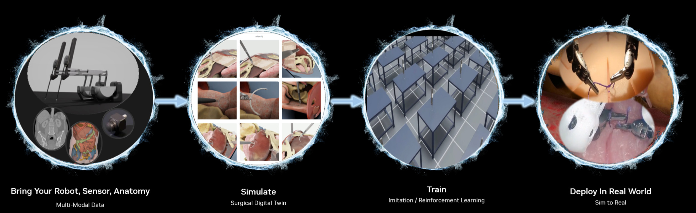

# What's New in Isaac for Healthcare Workflows v0.1.0 🎉🎉

- **Robotic Ultrasound Workflow**: Comprehensive simulation environment for robotic ultrasound procedures with teleoperation, state machines, and realistic ultrasound imaging.
- **Robotic Surgery Workflow**: Tools and examples for simulating surgical robot tasks with state machine implementations and reinforcement learning capabilities.
- **Tutorials**: Step-by-step guides for customizing simulation environments with your own patient data and robot models.

## Robotic Ultrasound Workflow

The Robotic Ultrasound Workflow provides a comprehensive instruction for simulating and developing robotic ultrasound workflow. Key features include:

*   **Policy Evaluation & Runner:** Includes examples for running pre-trained policies within the simulation.
*   **State Machine Examples:** Demonstrates structured task execution, like a liver scan state machine with data collection capabilities.
*   **Teleoperation:** Allows direct control of the robotic arm using keyboard, SpaceMouse, or gamepad for precise manipulation of the ultrasound probe.
*   **Ultrasound Raytracing:** Implements a standalone ultrasound raytracing simulator that generates realistic ultrasound images based on 3D meshes.
*   **DDS Communication:** Utilizes RTI Connext DDS for inter-process communication between simulation, policy runners, and visualization tools.

Learn more in the [Robotic Ultrasound Workflow README](../../workflows/robotic_ultrasound/README.md).

## Robotic Surgery Workflow

The Robotic Surgery Workflow provides tools and examples for simulating surgical robot tasks, focusing on training and evaluating robotic policies. Based initially on the [ORBIT-Surgical](https://orbit-surgical.github.io/) framework, it includes:

*   **State Machine Implementations:** Examples of state-based control for surgical procedures.
*   **Reinforcement Learning:** Provides a framework for training RL policies for surgical subtasks.

Learn more in the [Robotic Surgery Workflow README](../../workflows/robotic_surgery/README.md).

## Tutorials

Get started with customizing the simulation environment:

*   [Bring Your Own Patient](../../tutorials/assets/bring_your_own_patient/README.md): Learn how to import and integrate custom CT or MRI scans into USD (Universal Scene Description) files for simulation.
*   [Bring Your Own Robot](../../tutorials/assets/bring_your_own_robot/README.md): Guidance on importing custom robot models (CAD/URDF) and replacing components, such as swapping a gripper for an ultrasound probe.
*   [Sim2Real Transition](../../tutorials/sim2real/README.md): Outlines steps for adapting policies trained in simulation for deployment on the physical world system using DDS for data transfer.
