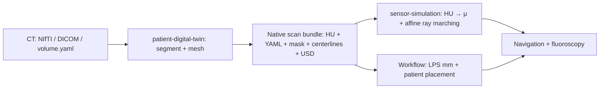

# Patient twin preparation

`run.sh` runs the `patient-digital-twin` command-line tool with `--format bundle`
in a pinned environment and writes the `patient_twin.yaml` bundle consumed by
`endoluminal_navigation`. Model inference, named mesh extraction, centerlines, HU
export, and USD output all belong to that library; this directory only pins it.

## Install

`third_party/setup.sh` pins the patient library commit. To build against a local
checkout instead, override its source:

```bash
I4H_DIGITAL_TWIN_URL=/absolute/path/to/i4h-digital-twin \
  ./third_party/setup.sh patient-twin
```

Set `I4H_DIGITAL_TWIN_REF` to test a different commit. The checkout is kept at
`third_party/i4h-digital-twin`. Install only the optional inference backend you use:

```bash
uv sync --project tools/patient_twin --extra nvsegment
# Or: uv sync --project tools/patient_twin --extra nvgenerate
```

Provide the upstream source checkout and model weights separately. Inference uses
Python imports in the tool's environment by default. `--python` optionally selects
a separate compatible GPU environment.

## Segment a CT

```bash
./tools/patient_twin/run.sh --source nvsegment \
  --input /path/to/s0011/ct.nii.gz --classes aorta \
  --bundle-root /path/to/NV-Segment-CTMR/NV-Segment-CTMR \
  --output ./data/patient_twins/s0011_aorta

./run.sh endoluminal_navigation --mode validate_fluoroscopy --episodes 1 \
  --patient-twin ./data/patient_twins/s0011_aorta/patient_twin.yaml \
  --record verify.hdf5
```

The input is a 3D CT NIfTI, DICOM CT directory, or `volume.yaml`; supplied dataset
masks are not read. For DICOM, install the tool's `dicom` extra and use
`--series-uid` if multiple series are present. `--classes` accepts space- or
comma-separated names. Output must be a new directory. For generation, use
`--source nvgenerate --source-root /path/to/NV-Generate-CTMR` and omit `--input`.



Bundles (schema 2) preserve the scan as acquired: source array order, spacing,
origin, and orientation including oblique grids, in the scanner's frame (RAS or
LPS) and units. `volume.npy` and `volume.yaml` hold HU and its full affine;
anatomy and centerlines use the same scan frame and units. When the workflow loads
a bundle, `PatientTwin` converts everything to patient LPS millimetres once and
places the patient on the table; nothing downstream sees the source frame. Bundles
from the earlier workflow pipeline (schema 1) are no longer read; rebuild them with
the command above.

Attenuation conversion belongs to `xray_simulator` in sensor-simulation and runs
when the workflow loads the bundle. Navigation defaults to `interventional`,
without HU pre-clipping; add `--hu-to-mu linear` to the **workflow** command for
the sensor library's general-purpose linear curve. Rebuilding the bundle is
unnecessary.

`./third_party/setup.sh sensor-simulation` installs the pinned sensor-simulation
source used by Arena; `I4H_SENSOR_SIM_URL` and `I4H_SENSOR_SIM_REF` override it.
