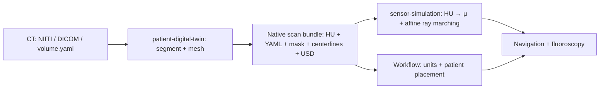

# Patient twin preparation

This tool calls `patient_digital_twin.__main__` and returns the `patient_twin.yaml`
bundle consumed by `endoluminal_navigation`. Model inference, named mesh
extraction, centerlines, HU export, and USD output belong to that library.

## Install

`third_party/setup.sh` pins the patient library commit that adds this pipeline.
To test these paired branches before the library commit is published, use a
local checkout as the source:

```bash
I4H_DIGITAL_TWIN_URL=/absolute/path/to/i4h-digital-twin \
  ./third_party/setup.sh patient-twin
uv sync --project tools/patient_twin --extra dev
```

After that commit is available upstream, omit the URL override. Set
`I4H_DIGITAL_TWIN_REF` to test a different commit. The checkout is kept at
`third_party/i4h-digital-twin`; existing simulation dependency checkouts are
independent of it. Install only the optional inference backend you use:

```bash
uv sync --project tools/patient_twin --extra nvsegment
# Or: uv sync --project tools/patient_twin --extra nvgenerate
```

Provide the upstream source checkout and model weights separately. Inference uses
Python imports in the tool's environment by default. `--python` optionally selects
a separate compatible GPU environment.

## Segment a CT

```bash
./tools/patient_twin/run.sh --source nvsegment \
  --input /path/to/s0011/ct.nii.gz --classes aorta \
  --bundle-root /path/to/NV-Segment-CTMR/NV-Segment-CTMR \
  --output ./data/patient_twins/s0011_aorta

./run.sh endoluminal_navigation --mode validate_fluoroscopy --episodes 1 \
  --patient-twin ./data/patient_twins/s0011_aorta/patient_twin.yaml \
  --record verify.hdf5
```

The input is a 3D CT NIfTI, DICOM CT directory, or `volume.yaml`; supplied dataset
masks are not read. For DICOM, install the tool's `dicom` extra and use
`--series-uid` if multiple series are present. `--classes` accepts space- or
comma-separated names. Output must be a new directory.



Schema-3 bundles preserve source scan axes, spacing, origin, and orientation,
including oblique grids. `volume.npy` and `volume.yaml` describe HU and its full
affine; anatomy and centerlines use the declared scan frame/units. Centerlines
come from the retained CT-grid labels. The workflow applies simulator placement
and unit conversion when loading the bundle; these are no longer baked into exports.
Older schema-1/2 bundles remain supported.

Attenuation conversion belongs to `xray_simulator` in sensor-simulation and runs
when the workflow loads the HU bundle. The default is `linear`, without HU
pre-clipping. Add `--hu-to-mu interventional` to the **workflow** command to select
the interventional curve; rebuilding the patient bundle is unnecessary. Schema-1
bundles continue using their stored μ unless a preset is explicitly selected.

`./third_party/setup.sh xray` installs the pinned public sensor-simulation source
used by Arena. `I4H_XRAY_SIM_URL` and `I4H_XRAY_SIM_REF` override that checkout.

For generation, use `--source nvgenerate --source-root /path/to/NV-Generate-CTMR`
and omit `--input`. For standalone USD, use the library's
`python -m patient_digital_twin --format usd` entry point.

The isolated `patient_digital_twin.legacy_ct` module implements the temporary CT
artifact compatibility layer. The workflow carries no duplicate CT processing,
segmentation fallback, or anatomy USD writer.

Run the tool's CPU contract tests with:

```bash
PYTHONDONTWRITEBYTECODE=1 uv run --project tools/patient_twin --extra dev pytest tools/patient_twin/tests
```
