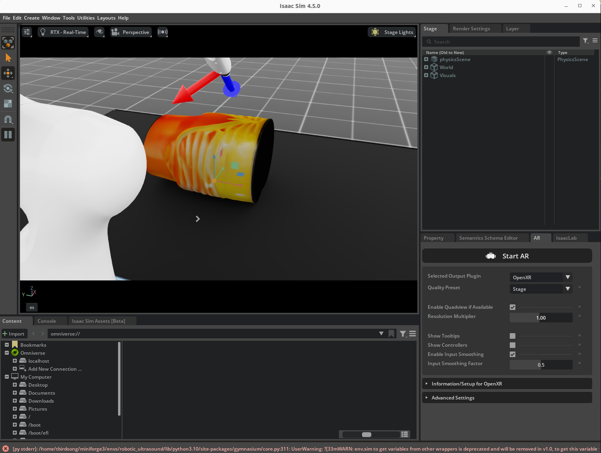
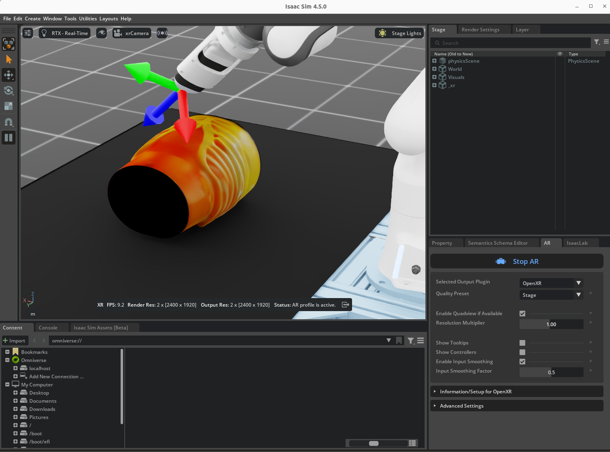

# Bring Your Own Head-Mounted Display with OpenXR

This guide helps you use your own OpenXR-enabled mixed reality device for simulated robotic teleoperation in Isaac Lab.


# Background

The [Robotic Ultrasound workflow](/workflows/robotic_ultrasound/) provides an example of robotic teleoperation in an Isaac Lab simulation.
Teleoperation serves as an alternative to pre-defined [state machine](/workflows/robotic_ultrasound/scripts/simulation/environments/state_machine/)
inputs, allowing a human operator to directly guide the robot in a task to collect policy training data. Isaac Lab supports multiple
types of teleoperation inputs, ranging from traditional keyboard input to hand tracking from a mixed reality device such as the
Apple Vision Pro headset.

Teleoperation with a mixed reality device provides two key advantages:
- Immersive stereoscopic rendering in a headset provides an inherent sense of depth and scale to support fine task completion and relative positioning during operation.
- Hand tracking control input can provide intuitive 6DOF control for faster training data collection, compared with other 6DOF inputs such as a keyboard or space mouse.

The [OpenXR](https://www.khronos.org/openxr/) API is an industry standard supporting a variety of mixed reality headsets and related
spatial computing devices. Application creators develop against a device-agnostic set of APIs, which can then be used with any OpenXR runtime
published by mixed reality device providers.

Some examples of OpenXR runtimes include:
- the NVIDIA CloudXR OpenXR container application
- Valve's SteamVR application
- Meta's Quest Link application

You may use Isaac Lab teleoperation with any OpenXR compatible device and associated runtime with hand tracking support.
In this tutorial we will focus on the NVIDIA CloudXR OpenXR runtime with support for the Apple Vision Pro headset.

# Prerequisites

## Robotic Ultrasound in Isaac Lab

Please review the [Robotic Ultrasound workflow setup instructions](/workflows/robotic_ultrasound/README.md) for minimum system requirements.

Mixed reality rendering can be GPU intensive. An NVIDIA RTX A6000 discrete GPU or greater is recommended. Performance may suffer on lower versions.

## Mixed Reality Device

A mixed reality headset and associated runtime with OpenXR and hand tracking support is required for XR hand tracking teleoperation in Isaac Lab.

See the [IsaacLab CloudXR Teleoperation Tutorial](https://isaac-sim.github.io/IsaacLab/main/source/how-to/cloudxr_teleoperation.html#system-requirements) for
system requirements and recommendations:
- [Apple Vision Pro headset](https://www.apple.com/apple-vision-pro/) with visionOS 2.0 or later
- To build and deploy the [Isaac XR Teleop Sample Client for Apple Vision Pro](https://github.com/isaac-sim/isaac-xr-teleop-sample-client-apple):
  - Apple Silicon based Mac with XCode 16 or later
  - An Apple Developer account
- A dedicated Wifi 6 router (Local Area Network)

Additional host system requirements for the workstation running Isaac Lab are as follows:
- Ubuntu 22.04 or later
- [Docker](https://www.docker.com/get-started/) 26.0.0 or later
- [NVIDIA Container Toolkit](https://docs.nvidia.com/datacenter/cloud-native/container-toolkit/latest/install-guide.html) 1.14 or later

Note that mixed reality rendering can be compute intensive. Review the NVIDIA CloudXR recommended Linux workstation specifications for best performance:
- Intel Core i9 or AMD Ryzen 9 Threadripper (or higher)
- 64GB RAM
- 2x RTX 6000 Ada discrete GPUs (or equivalent)

Review the latest CloudXR Runtime End User License Agreement on [NGC](https://catalog.ngc.nvidia.com/orgs/nvidia/containers/cloudxr-runtime) before running the CloudXR container.

# Setup

## Robotic Ultrasound Workflow

Please follow the [Robotic Ultrasound workflow setup instructions](/workflows/robotic_ultrasound/README.md) to install dependencies, download assets, and set environment variables.

## NVIDIA CloudXR Teleop Sample Client for Apple Vision Pro

Set up your Apple Vision Pro and enable Developer Mode.

On your Mac development machine, clone the [Isaac XR Teleop Sample Client](https://github.com/isaac-sim/isaac-xr-teleop-sample-client-apple) GitHub repository:
```bash
git clone git@github.com:isaac-sim/isaac-xr-teleop-sample-client-apple.git
```

Follow the repository README document to build the application and deploy to your Apple Vision Pro on the local network.

**Note**: Using an enterprise network may prevent your Apple Vision Pro, Macbook, and Linux host machine from discovering each other. Please consider using
a dedicated router for setup and runtime.

## NVIDIA CloudXR Runtime (Host System)

The [NVIDIA CloudXR Runtime](https://catalog.ngc.nvidia.com/orgs/nvidia/containers/cloudxr-runtime) is a containerized OpenXR runtime for remote bidirectional streaming
with the Apple Vision Pro device. In this section we will set up the runtime on the Linux host system to run alongside the Isaac Lab application and provide the OpenXR
implementation for robotic teleoperation.

1. Fetch the CloudXR Runtime container.
```bash
docker pull nvcr.io/nvidia/cloudxr-runtime:0.1.0-isaac
```

2. Create a folder for OpenXR data with your user permissions:
```bash
cd path/to/i4h-workflows
mkdir -p openxr
```

3. Open required firewall ports for CloudXR OpenXR connections:
```
sudo ufw allow 47998:48000,48005,48008,48012/udp
sudo ufw allow 48010/tcp
```

4. In a new terminal, run the CloudXR Runtime container with the mounted data folder:
```bash
cd path/to/i4h-workflows
docker run -it --rm --name cloudxr-runtime \
    --user $(id -u):$(id -g) \
    --gpus=all \
    -e "ACCEPT_EULA=Y" \
    --mount type=bind,src=$(pwd)/openxr,dst=/openxr \
    -p 48010:48010 \
    -p 47998:47998/udp \
    -p 47999:47999/udp \
    -p 48000:48000/udp \
    -p 48005:48005/udp \
    -p 48008:48008/udp \
    -p 48012:48012/udp \
    nvcr.io/nvidia/cloudxr-runtime:0.1.0-isaac
```

You will see a message in the terminal when the runtime is ready:
```bash
################################################################################
#                                                                              #
#               The NVIDIA™ CloudXR™ Runtime service has started.              #
#                                                                              #
################################################################################
```

5. Back in your Robotic Ultrasound workflow terminal, define the following environment variables:
```bash
export XDG_RUNTIME_DIR=<path/to/i4h-workflows>/openxr/run
export XR_RUNTIME_JSON=<path/to/i4h-workflows>/openxr/share/openxr/1/openxr_cloudxr.json
```

# Running XR Hand Tracking Teleoperation

## Launch Isaac Lab (Host System)

Run the following command to launch the teleoperation sample with XR support:

```bash
python environments/teleoperation/teleop_se3_agent.py --enable_cameras --teleop_device=handtracking --experience isaaclab.python.xr.openxr.kit
```

The sample application will launch as normal with an extra tab titled "AR". Navigate to the "AR" tab and verify that "OpenXR" is selected as the output plugin.



Click the "Start AR" button to launch the scene into stereo rendering mode with OpenXR.



**Note**: You can enter and exit the XR scene at any time before or after connecting the Apple Vision Pro device. The CloudXR OpenXR Runtime will receive frames but not transmit
to any device if no device is connected. Click "Stop AR" to exit the OpenXR session and return to the standard mono viewing mode.
**Note**: The robot may appear behind the initial XR position.

## Apple Vision Pro

Run the following command on your local workstation to view your IP address:
```bash
hostname -I | awk '{print $1}'
```

In your Apple Vision Pro headset, launch the Isaac XR Teleop Sample Client and enter your workstation IPv4 address from above. The UI will indicate a successful connection.

If you have previously launched the Isaac Lab scene into mixed reality mode, you will see an immersive rendering when you start the Apple Vision Pro client application.


**Note**: You can connect to and disconnect from the CloudXR runtime at any time without disrupting the Isaac Lab scene.

## Navigating with the CloudXR Teleop Sample Client

Use the CloudXR sample client UI in the Apple Vision Pro display to toggle among environment states:
- `STOPPED`: The default environment state is for static viewing only. Teleoperation with hand tracking is not run.
- `STARTED`: Enables teleoperation with hand tracking. 6DOF input from the right hand is used to inform the position of the target guide for the robotic ultrasound probe.
- `RESET`: Resets the scene to the default position.

# Limitations and Troubleshooting

- **Apple Vision Pro will not connect to Macbook or Linux workstation**

Please ensure that all participating machines are available on the same non-enterprise local network and review your firewall settings. Verify that you have enabled
[Developer Mode](https://developer.apple.com/documentation/xcode/enabling-developer-mode-on-a-device) on your Apple Vision Pro device. 

- **Mixed reality device framerate performance suffers**

Please ensure that your machine meets the [recommended specifications](#mixed-reality-device) for mixed reality teleoperation.

- **Why is Room Camera output not published over DDS?**

There is a known issue where the sample application encounters a blocking error if the room camera is polled during XR teleoperation with the following error:
```
  File ".../i4h-workflows/workflows/robotic_ultrasound/scripts/simulation/environments/teleoperation/teleop_se3_agent.py", line 349, in <module>
    main()
  File ".../i4h-workflows/workflows/robotic_ultrasound/scripts/simulation/environments/teleoperation/teleop_se3_agent.py", line 329, in main
    rgb_images, depth_images = capture_camera_images(
  File ".../i4h-workflows/workflows/robotic_ultrasound/scripts/simulation/environments/state_machine/utils.py", line 140, in capture_camera_images
    camera_data = env.unwrapped.scene[cam_name].data
  File ".../i4h-workflows/third_party/IsaacLab/source/isaaclab/isaaclab/sensors/camera/camera.py", line 179, in data
    self._update_outdated_buffers()
  File ".../i4h-workflows/third_party/IsaacLab/source/isaaclab/isaaclab/sensors/sensor_base.py", line 289, in _update_outdated_buffers
    self._update_buffers_impl(outdated_env_ids)
  File ".../i4h-workflows/third_party/IsaacLab/source/isaaclab/isaaclab/sensors/camera/camera.py", line 509, in _update_buffers_impl
    self._data.output[name][index] = data
RuntimeError: The expanded size of the tensor (3) must match the existing size (0) at non-singleton dimension 2.  Target sizes: [224, 224, 3].  Tensor sizes: [0]
```

The room camera is disabled pending further investigation. Wrist camera and joint position output are available over DDS.

- **The hand tracking sample API does not match the [Isaac Lab XR teleoperation tutorial](https://isaac-sim.github.io/IsaacLab/main/source/how-to/cloudxr_teleoperation.html#run-isaac-lab-with-the-cloudxr-runtime).**

At the time of writing, Isaac for Healthcare and the Robotic Ultrasound sample are based on an earlier version of Isaac Lab (v2.0.2). The XR teleoperation tutorial
leverages an updated XR teleoperation API available in Isaac Lab in versions v2.1.0 and later. We will update this tutorial at a future date to make use of the
latest API.

- **The robotic ultrasound arm is difficult to control.**

Mitigation is under review. A future update will leverage Isaac Lab Hand Tracking [Retargeters](https://isaac-sim.github.io/IsaacLab/main/source/how-to/cloudxr_teleoperation.html#retargeting-architecture) for greater parity between hand inputs and device position. Hand tracking retargeting is currently available in Isaac Lab v2.1.0 and later.

## Known Issues

- **I see a repeating console error when running XR teleoperation**

The following error has been observed from the wrist camera and is under investigation. Wrist camera data can be consumed via sample DDS topics during XR teleoperation.
```
2025-05-23 02:43:01 [29,668ms] [Error] [omni.syntheticdata.plugin] SdPostRenderVarTextureToBuffer : corrupted input renderVar LdrColorSD
2025-05-23 02:43:01 [29,668ms] [Error] [omni.syntheticdata.plugin] SdPostRenderVarTextureToBuffer : corrupted input renderVar DistanceToImagePlaneSD
```

- **I see an error when I start the XR session: `[omni.kit.xr.system.openxr.plugin] Message received from CloudXR does not have a field called 'type'`**

This error is caused by a deprecated, non-backwards-compatible data message sent by the CloudXR Framework from Apple Vision Pro and can be safely ignored.
