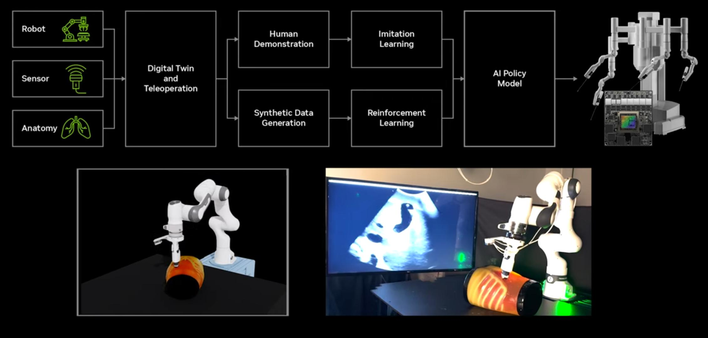

# Sim2Real

  [](https://www.youtube.com/watch?v=v1hdsGUHAgE)

## Overview

This tutorial outlines the steps required to transition a policy trained in simulation to operate in the real world using a physical robot and cameras.

The core script, [`workflows/robotic_ultrasound/scripts/policy_runner/run_policy.py`](../../workflows/robotic_ultrasound/scripts/policy_runner/run_policy.py), remains largely the same. Instructions for running this script can be found in the [policy_runner](../../workflows/robotic_ultrasound/scripts/policy_runner/README.md) directory. The primary task in moving from simulation to the real world involves changing the *source* of the input data (camera images and robot joint states) and the *destination* of the output actions.

Specifically:
1.  **Input:** Instead of reading from a simulator, the `run_policy.py` script needs to subscribe to DDS topics publishing real camera images and real robot joint states.
2.  **Output:** Instead of sending actions to a simulator, the `run_policy.py` script publishes actions to a DDS topic, which must then be read by a separate component that interfaces with the real robot controller.

The policy itself, ideally trained using resources from [`workflows/robotic_ultrasound/scripts/training/`](../../workflows/robotic_ultrasound/scripts/training/), does not need to change significantly. However, you will want to use some amount of real-world data alongside simulation data when training your policy. [Recent research](https://co-training.github.io/) indicates that with a sufficient amount of real world data, the optimal ratio of sim:real data is 9:1.

## Publishing Real-Time Sensor Data via DDS

To feed the policy runner real-world data, you need components that capture sensor information and publish it via DDS. The policies included in this repo rely on 2 inputs: camera frames and the robot joint states. The following code snippets provide examples of how to send these over DDS:


1.  **Camera Data Publishing:** Utilize the [NVIDIA Holoscan SDK](https://github.com/nvidia-holoscan/holoscan-sdk/tree/main) to capture images. Then, publish these images to DDS topics using a schema like `CameraInfo`.

    *Example Publisher (Inspired by [`sim_with_dds.py`](../../workflows/robotic_ultrasound/scripts/simulation/environments/sim_with_dds.py)):*
    ```python
    import numpy as np
    from dds.publisher import Publisher
    from dds.schemas.camera_info import CameraInfo
    import time

    # Assume you have a function to get the latest camera image
    def get_camera_image(camera_id):
        # Replace with your actual camera capture logic (e.g., using Holoscan SDK)
        # Returns a numpy array (e.g., HxWxC uint8)
        height, width = 224, 224
        return np.random.randint(0, 256, (height, width, 3), dtype=np.uint8)

    # Define DDS parameters
    dds_domain_id = 0 # Or your chosen domain ID
    camera_topic = "topic_your_camera_rgb" # Choose a topic name
    publish_rate_hz = 30

    # Create a DDS Publisher
    camera_publisher = Publisher(camera_topic, CameraInfo, 1.0 / publish_rate_hz, dds_domain_id)

    # --- In your camera publishing loop ---
    try:
        while True:
            img_data = get_camera_image(0) # Example for one camera
            output = CameraInfo()
            output.height = img_data.shape[0]
            output.width = img_data.shape[1]
            output.data = img_data.tobytes() # Serialize NumPy array to bytes
            camera_publisher.write(output)
            time.sleep(1.0 / publish_rate_hz)
    except KeyboardInterrupt:
        print("Stopping publisher...")
    finally:
        pass # Cleanup if needed
    ```

2.  **Robot Joint State Publishing:** The policy often requires the robot's current joint positions as input. You need to read these from your robot controller and publish them via DDS using a schema like `FrankaInfo`.

    *Example Publisher (Inspired by [`sim_with_dds.py`](../../workflows/robotic_ultrasound/scripts/simulation/environments/sim_with_dds.py)):*
    ```python
    import numpy as np
    from dds.publisher import Publisher
    from dds.schemas.franka_info import FrankaInfo
    import time

    # Assume you have a function to get the robot's current joint positions
    def get_robot_joint_positions():
        # Replace with your actual robot interface logic
        # Returns a list or numpy array of joint angles (e.g., 7 DoF for Franka)
        return np.random.rand(7).tolist()

    # Define DDS parameters
    dds_domain_id = 0 # Or your chosen domain ID
    joint_state_topic = "topic_franka_info" # Match the topic expected by run_policy.py
    publish_rate_hz = 30 # Or match your robot's state update rate

    # Create a DDS Publisher
    joint_state_publisher = Publisher(joint_state_topic, FrankaInfo, 1.0 / publish_rate_hz, dds_domain_id)

    # --- In your robot state publishing loop ---
    try:
        while True:
            current_joints = get_robot_joint_positions()
            output = FrankaInfo()
            # Ensure the correct field is populated based on FrankaInfo schema
            output.joints_state_positions = current_joints
            joint_state_publisher.write(output)
            time.sleep(1.0 / publish_rate_hz)
    except KeyboardInterrupt:
        print("Stopping publisher...")
    finally:
        pass # Cleanup if needed
    ```

## Running the Policy ([`run_policy.py`](../../workflows/robotic_ultrasound/scripts/policy_runner/run_policy.py))

The [`run_policy.py`](../../workflows/robotic_ultrasound/scripts/policy_runner/run_policy.py) script, located in [`workflows/robotic_ultrasound/scripts/policy_runner/`](../../workflows/robotic_ultrasound/scripts/policy_runner/), acts as the "brain". It subscribes to the DDS topics published above (camera images, joint states) and publishes computed actions.

*   **Configuration:** Ensure the `--topic_in_...` arguments of `run_policy.py` match the topics you are publishing the real sensor data to (e.g., `"topic_your_camera_rgb"`, `"topic_franka_info"`). The `--topic_out` argument defines where the computed actions will be published (e.g., `"topic_franka_ctrl"`). You may also need to adjust settings in [`config.py`](../../workflows/robotic_ultrasound/scripts/policy_runner/pi0_policy/config.py) within the same directory.

## Controlling the Real Robot

You need a separate component that subscribes to the action topic published by `run_policy.py` and translates these actions into commands for your physical robot.

*   **Joint Topic Listener:** Implement a DDS subscriber listening to the action topic (e.g., `"topic_franka_ctrl"`) using a schema like `FrankaCtrlInput`.
*   **Robot Controller Interface:** This listener must translate the received DDS messages (e.g., target joint positions or position deltas contained in `FrankaCtrlInput`) into commands compatible with your specific robot's controller API. For our Franka-based ultrasound system, we used the [libfranka](https://github.com/frankaemika/libfranka) library to apply the policy's predicted actions to the robotic arm.
*   **Controller Requirement:** Your robot's control system must be capable of accepting the type of commands published by the policy (e.g., target joint positions for inverse kinematic control, or relative joint movements).

    *Example Subscriber (Inspired by [`sim_with_dds.py`](../../workflows/robotic_ultrasound/scripts/simulation/environments/sim_with_dds.py)):*
    ```python
    import numpy as np
    from dds.subscriber import SubscriberWithQueue
    from dds.schemas.franka_ctrl import FrankaCtrlInput
    import time # Added for potential sleep

    # Define DDS parameters (replace with your actual values)
    dds_domain_id = 0 # Or your chosen domain ID
    joint_command_topic = "topic_franka_ctrl" # Topic published by run_policy.py
    read_interval = 1 / 30 # Example interval

    # Create and start the subscriber
    joint_cmd_subscriber = SubscriberWithQueue(dds_domain_id, joint_command_topic, FrankaCtrlInput, read_interval)
    joint_cmd_subscriber.start()

    # --- In your robot control loop ---
    try:
        while True: # Your robot control loop condition
            received_data: FrankaCtrlInput = joint_cmd_subscriber.read_data()

            if received_data is not None:
                # Extract commands based on FrankaCtrlInput schema
                joint_commands = np.array(received_data.joint_positions, dtype=np.float32)
                # --> Add logic here to send joint_commands to your robot controller <--
                print(f"Received joint commands: {joint_commands.shape}")
                # Example: send_to_robot_controller(joint_commands)

            # Optional sleep or rate limiting
            # time.sleep(read_interval / 2) # Example sleep

    except KeyboardInterrupt:
        print("Stopping subscriber...")
    finally:
        joint_cmd_subscriber.stop()
    ```
