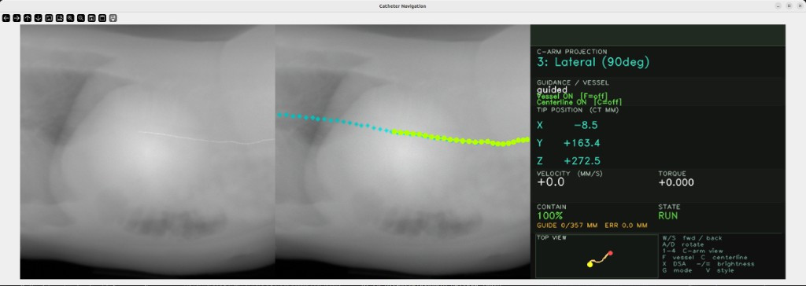

# Catheter Navigation Workflow



---

## Overview

The Catheter Navigation Workflow provides a GPU-accelerated simulation environment for training and deploying autonomous endovascular catheter and guidewire navigation systems. It combines a physics-accurate fluoroscopy (X-ray) renderer with an XPBD rod physics solver and a patient vasculature digital twin, forming a complete data factory for reinforcement learning and imitation learning policies.

The workflow is designed for interventional cardiology researchers, medical device manufacturers, and AI policy developers working on tasks such as TAVR (Transcatheter Aortic Valve Replacement) guidance, coronary intervention, and endovascular navigation.

---

## Table of Contents

- [Overview](#overview)
- [Key Components](#key-components)
- [Directory Structure](#directory-structure)
- [Requirements](#requirements)
- [Quick Start](#quick-start)
- [How to run](#how-to-run)
  - [Via the i4h CLI](#via-the-i4h-cli)
  - [Directly with `python -m`](#directly-with-python--m)
  - [Interactive viewport controls](#controls)
- [Troubleshooting](#troubleshooting)

---

## Key Components

### Fluoroscopy Simulator (`fluorosim`)

GPU-accelerated Digitally Reconstructed Radiograph (DRR) renderer implemented in [Slang](https://github.com/shader-slang/slang):

- **Beer-Lambert catheter compositing** — fused ray march that correctly composites catheter attenuation with the CT background in a single GPU dispatch
- **Batched multi-environment rendering** — single-dispatch rendering for N parallel RL environments via `Texture2DArray`
- **DSA pipeline** — Digital Subtraction Angiography with independent noise, Compton scatter, and sub-pixel misregistration
- **Detector realism** — gain/bias, Poisson noise, Gaussian noise, PSF blur, gamma correction
- **Differentiable rendering** — Slang autodiff for gradient-based pose estimation

### Physics Solver (`fluorosim/catheter`)

XPBD Cosserat rod solver for real-time catheter and guidewire simulation:

- `XPBDRodSolver` — batched multi-rod GPU solver with CUDA graph capture
- `XCathRodSolver` — extends `XPBDRodSolver` with vessel-mesh containment (SDF/BVH + AABB/edge broadphase) and track-guided insertion
- `NewtonXPBDRodSolver` — Newton-XPBD hybrid solver

### Vasculature Digital Twin (`fluorosim/vasculature`)

Patient-specific vessel reconstruction from CT:

- CT ingestion (DICOM/NIfTI), HU thresholding, TotalSegmentator segmentation
- VTK marching cubes meshing, Windowed Sinc smoothing
- VMTK / Dijkstra centerline extraction
- Warp BVH mesh for GPU collision queries

### Decoupled CatheterProvider Interface

The `FluoroSimulator` is decoupled from the physics solver via the `CatheterProvider` protocol.
Any solver (or custom data source) can be attached without modifying the renderer:

```python
from fluorosim import FluoroSimulator
from fluorosim.catheter_provider import SolverCatheterAdapter
from fluorosim.catheter import XCathRodSolver

solver = XCathRodSolver(...)  # see fluorosim/examples for full construction
provider = SolverCatheterAdapter(solver, radii=0.5, mu_values=1.5, scale=1000.0)

sim = FluoroSimulator(volume, config, catheter_provider=provider)

for pose in trajectory:
    solver.step(dt)
    frame = sim.render_frame(pose=pose)   # catheter fetched automatically
```

---

## Directory Structure

```text
catheter_navigation/
├── scripts/
│   └── simulation/
│       └── fluorosim/          # Core fluoroscopy + physics simulator package
│           ├── catheter/       # XPBD rod solvers (XPBDRodSolver, XCathRodSolver)
│           ├── rendering/      # Slang DRR renderer + DSA pipeline
│           ├── catheter_provider.py  # Decoupled CatheterProvider protocol + adapters
│           ├── simulator.py    # FluoroSimulator high-level API
│           ├── preprocessor.py # CT volume preprocessing
│           └── vasculature.py  # Vessel mesh + centerline extraction
├── tests/
└── docker/
```

---

## Requirements

### GPU

- **NVIDIA GPU** with CUDA Compute Capability ≥ 7.0 (Volta or later); Ampere (≥ 8.0) or newer recommended.
- **VRAM**: ≥ 8 GB for single-environment interactive use; ≥ 16 GB recommended for batched multi-environment rendering / data generation.
- Vulkan-capable driver (required by the Slang DRR renderer).

### Driver & System

- **CPU architecture**: x86_64
- **Operating system**: Ubuntu 22.04 or 24.04 LTS
- **NVIDIA driver**: compatible with CUDA 12.8 (typically ≥ 570)
- **CUDA toolkit**: 12.8 (matches the workflow Docker image)
- **System RAM**: ≥ 16 GB (≥ 32 GB recommended for CT volume preprocessing + segmentation)
- **Storage**: ≥ 20 GB free (workflow plus one CT subject; the TotalSegmentator small subset alone is ~3.2 GB)

### Tested Configuration

This workflow has been tested on the following configuration:

- **GPU**: NVIDIA RTX A6000 (48 GB VRAM)
- **NVIDIA driver**: 570.211.01
- **CUDA**: 12.8
- **OS**: Ubuntu 22.04.5 LTS (kernel 6.8.0)
- **CPU architecture**: x86_64
- **System RAM**: 125 GB

---

## Quick Start

Everything runs through the repo's `./i4h` CLI from the repository root. List the
available modes:

```bash
./i4h modes catheter_navigation
```

Then launch the interactive fluoroscopy viewport against a preprocessed CT cache
(one-liner):

```bash
./i4h run catheter_navigation interactive_viewport --local --run-args="--ct-dir /tmp/ct_cache --vessel-source real --insertion-axis centerline --dsa"
```

See [How to run](#how-to-run) for downloading a CT dataset and building the
`/tmp/ct_cache` (preprocess → segment) that the command above expects.

---

## How to run

> **No data or digital twin is shipped.** No CT scans, attenuation volumes,
> vessel masks, meshes, or centerlines are committed. You generate the
> vasculature digital twin locally from a CT volume you supply
> (`preprocess_ct` → `segment_vessels`). Bring your own data (e.g. the public
> TotalSegmentator dataset below) and comply with that dataset's license.

This workflow registers with the repo's `./i4h` CLI, so each stage can be run
either through the CLI or directly with `python -m`.

### Via the i4h CLI

> **Run these from the repository root** (where the `./i4h` script lives), **not**
> from `workflows/catheter_navigation/`. `--local` runs on the host; drop it to
> run in Docker. Extra arguments are forwarded with `--run-args="…"`.

```bash
cd /path/to/i4h-workflows          # repo root containing ./i4h
./i4h modes catheter_navigation        # list available modes
./i4h run catheter_navigation preprocess_ct --local \
  --run-args="--nifti /path/to/ct.nii.gz --output-dir /tmp/ct_cache --save-hu"
./i4h run catheter_navigation segment_vessels --local \
  --run-args="--ct-dir /tmp/ct_cache --ts-gt-dir /path/to/segmentations"
./i4h run catheter_navigation interactive_viewport --local \
  --run-args="--ct-dir /tmp/ct_cache --vessel-source real --insertion-axis centerline --det-size 1024 --pixel-spacing-mm 0.6 --dsa"
```

### Directly with `python -m`

All commands assume the package is importable:

```bash
cd workflows/catheter_navigation
export PYTHONPATH="$PWD/scripts/simulation:$PYTHONPATH"
```

### 1. Download a CT dataset (TotalSegmentator)

Contrast-enhanced CTA subjects work best for vessel navigation. The dataset is
published as a single zip, so download the small **102-subject subset (~3.2 GB)**
and extract one subject. Zenodo's direct download is heavily throttled, so prefer
the authors' Dropbox mirror:

```bash
# Recommended: Dropbox mirror (full speed). Downloads into the current directory.
curl -L "https://www.dropbox.com/scl/fi/pee5yxebfxrhz007cbuy5/Totalsegmentator_dataset_small_v201.zip?rlkey=osvfk02jc4lw5gr6uhrldtb9e&dl=1" \
  -o Totalsegmentator_dataset_small_v201.zip
unzip Totalsegmentator_dataset_small_v201.zip -d Totalsegmentator_dataset_small_v201

# Fallback: Zenodo (throttled). Small subset is record 10047263; full set is 10047292.
# pip install zenodo_get && zenodo_get 10047263

ls Totalsegmentator_dataset_small_v201   # list subjects, pick one
```

### 2. Build the digital twin from a subject

```bash
SUBJ=/path/to/Totalsegmentator_dataset_small_v201/s0011   # any extracted subject
CACHE=/tmp/ct_cache

# CT → attenuation volume (mu_volume.npy + metadata.json); keep HU for masking
python -m fluorosim.examples.preprocess_ct --nifti "$SUBJ/ct.nii.gz" --output-dir "$CACHE" --save-hu

# Segment the arterial tree → vessel_mask + centerline (this IS the digital twin)
python -m fluorosim.examples.segment_vessels --ct-dir "$CACHE" --ts-gt-dir "$SUBJ/segmentations"
```

### 3. Interactive viewport

```bash
python -m fluorosim.examples.interactive_catheter_slang_viewport \
  --ct-dir /tmp/ct_cache \
  --vessel-source real --insertion-axis centerline \
  --det-size 1024 --pixel-spacing-mm 0.6 --dsa
```

#### Controls

| Input | Action |
|---|---|
| **W / S** (or ↑ / ↓) | Advance / retract the catheter along the centerline |
| **A / D** (or ← / →) | Rotate catheter CCW / CW |
| **Shift** | Boost command magnitude |
| **F** | Toggle vessel overlay |
| **C** | Toggle centerline overlay |
| **X** | Toggle the DSA contrast bolus on / off |
| **− / =** | DSA brightness: darker / brighter |
| **V** | Toggle visual style (cinematic / default) |
| **1 / 2 / 3 / 4** | C-arm projection: AP / LAO-45 / Lateral / RAO-30 |
| **Space** | Pause / resume |
| **R** | Reset catheter to initial state |
| **Q / Esc** | Quit |
| Mouse left-drag | Horizontal = insertion/retraction velocity; vertical = torque |

---

## Troubleshooting

### Remote / headless displays: viewport controls appear dead

On some Linux X11 setups (VNC, Chrome Remote Desktop, virtual `:N` displays)
OpenCV's Qt build auto-selects a platform plugin that never delivers key events,
so the interactive viewport's controls appear dead. The viewport forces the
`xcb` plugin automatically; if input still doesn't register, launch with the
plugin set explicitly — via the `./i4h` CLI:

```bash
QT_QPA_PLATFORM=xcb ./i4h run catheter_navigation interactive_viewport --local --run-args="--ct-dir /tmp/ct_cache --vessel-source real --insertion-axis centerline --dsa"
```

or directly with `python -m`:

```bash
QT_QPA_PLATFORM=xcb python -m fluorosim.examples.interactive_catheter_slang_viewport …
```

Many remote window managers also use *focus-follows-mouse*: keep the mouse
pointer over the fluoro image while pressing keys, or the input is routed
elsewhere.
