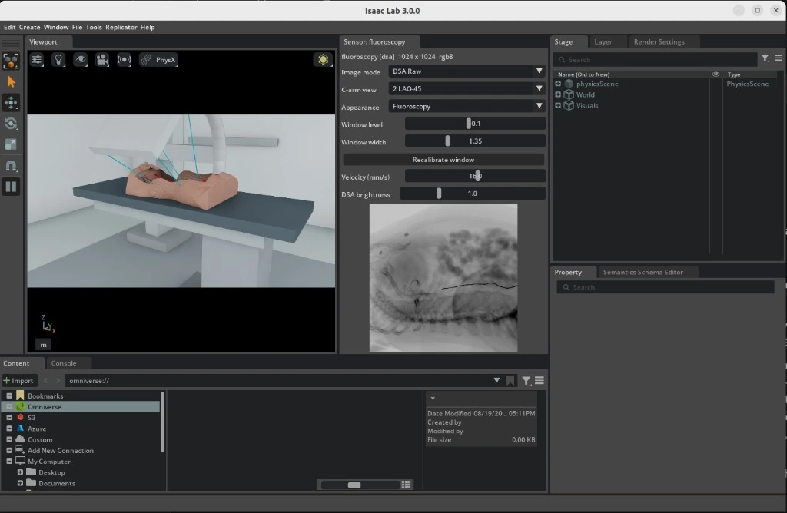

# Endoluminal Robotics Workflows

Workflows for navigation and intervention through luminal anatomy.

## Workflows

| Workflow | Demonstration | Supported modes ([guide](../../i4h_workflow_modes/README.md)) |
| --- | --- | --- |
| [`endoluminal_navigation`](endoluminal_navigation.py) | Navigate a catheter and movable C-arm with a live fluoroscopy view. | `demo`, `teleop`, `validate_fluoroscopy`, `idle` |

`demo` and `validate_fluoroscopy` are workflow-specific extensions, not standard run modes.

## Demonstrations

| [`endoluminal_navigation`](endoluminal_navigation.py) |
| :---: |
|  |

The viewport carries the C-arm, table and patient; the fluoroscopy panel carries the detector image and the controls that drive it. An [animated capture](../../../docs/workflows/images/fluoroscopy_catheter_navigation.gif) shows a C-arm sweep in motion.

Note: Complete the [project setup](../../../README.md#setup-from-the-command-line) before you begin.

## Run with an AI Agent

Paste any prompt into Claude Code, Codex, or the repository's [Local Agent](../../../local-agent/README.md):

```text
Run endoluminal_navigation in demo mode for 1 episode without patient CT data.

Prepare TotalSegmentator sample s0011 as a patient twin.
Run endoluminal_navigation in demo mode and verify fluoroscopy.

Start endoluminal_navigation teleop with the prepared s0011 patient twin.
```

## Run from the Command Line

### Procedural demonstration

Run the procedural demonstration without patient data:

```bash
./run.sh endoluminal_navigation --mode demo
```

This uses a procedural patient shape, synthetic fluoroscopy, and the default physics settings. Newton is not required.

### Patient CT

Download the public [TotalSegmentator small dataset](https://zenodo.org/records/10047263) (3.2 GB) and prepare subject `s0011`:

```bash
mkdir -p ./data/TotalSegmentator

curl -L --fail --show-error \
  "https://zenodo.org/records/10047263/files/Totalsegmentator_dataset_small_v201.zip" \
  -o ./data/Totalsegmentator_dataset_small_v201.zip

unzip -q ./data/Totalsegmentator_dataset_small_v201.zip -d ./data/TotalSegmentator
./tools/patient_twin/run.sh ./data/TotalSegmentator/s0011
```

Preparation reads the CT and its vessel labels through the `vasculature_digital_twin` package, which resolves each file's own direction cosines and reorients everything onto the canonical LPS patient axes. A study stored feet first, or a label file saved with a different slice order, therefore lands on the same axes as the rest of the twin instead of mirroring the anatomy; the manifest records the frame as `DICOM_LPS` and `metadata.json` keeps the orientation the source was stored in. A genuinely oblique acquisition is rejected rather than reoriented, because the renderer samples an axis-aligned voxel grid.

For a subject that ships a CT and no `segmentations/` directory, pass `--segment-vessels` to derive the vasculature with the package's own segmenter instead of reading label files.

Run the demo using the generated manifest:

```bash
./run.sh endoluminal_navigation \
  --mode demo \
  --patient-twin ./data/TotalSegmentator/s0011/patient_twin.yaml
```

### Keyboard teleoperation

Launch teleoperation:

```bash
./run.sh endoluminal_navigation \
  --teleop \
  --patient-twin ./data/TotalSegmentator/s0011/patient_twin.yaml
```

Click inside the Isaac window before using the keyboard. The fluoroscopy window provides image, C-arm view, velocity, and brightness controls.

| Keys  | Action                                              |
| ----- | --------------------------------------------------- |
| W / S | Insert / retract catheter                           |
| A / D | Rotate catheter                                     |
| Q / E | Fine C-arm rotation                                 |
| R     | Reset the catheter and C-arm to their initial state |
| L     | Clear a stuck keyboard command                      |

### Fluoroscopy validation

This mode succeeds only if moving the C-arm changes the fluoroscopy image:

```bash
./run.sh endoluminal_navigation \
  --mode validate_fluoroscopy \
  --episodes 2 \
  --patient-twin ./data/TotalSegmentator/s0011/patient_twin.yaml
```

### Recording

Add `--record` to store synchronized actions, state, and fluoroscopy frames:

```bash
./run.sh endoluminal_navigation \
  --teleop \
  --patient-twin ./data/TotalSegmentator/s0011/patient_twin.yaml \
  --record --record-failures
```

Recordings are stored under `./runs/endoluminal_navigation/<timestamp>/`. Teleoperation has no completion key, so `--record-failures` preserves the session.

## Unified Simulation Loop

The loop is unified in the sense that three separately maintained packages act on one anatomical domain, through one coordinate chain, advanced by one owner of time. No stage re-derives the anatomy for its own use.

| Stage | Artifact it owns | Role in the loop |
| --- | --- | --- |
| `vasculature_digital_twin`, through `PatientTwin` | `mu_volume.npy`, `metadata.json`, centerline graph, vessel mask, anatomy USD | Attenuation field, insertion path, and the transforms every other stage is expressed in |
| `catheter_vasculature_solver.CathRodSolver` | node positions and orientations in solver-local metres | Advances the rod under Cosserat stretch and Darboux constraints, plus its projections |
| `xray_simulator` Slang DiffDRR, with `CatheterAttenuation` | the detector image | Marches CT attenuation and catheter attenuation into one Beer-Lambert exponent |

`arena/i4h_arena/runner.py` is the only caller of `env.step`, and immediately after each step it invalidates the single read cache that the fluoroscopy window, the recorder, and the publisher all read through. That is what makes a recorded step self-consistent: the image, the action, and the joint state describe the same simulator state rather than three states a frame apart.

Notation used below:

```text
x_i, q_i    node position (solver-local metres) and orientation (unit quaternion), i = 0..N
l, N, r     segment rest length, segment count, rod radius
mu          attenuation field [1/mm] on the twin's ZYX voxel grid, trilinearly sampled
gamma(s)    centerline by arclength, [0, L_path] -> world metres
s           insertion arclength of the rod's proximal end
A           affine transform, volume millimetres -> world metres
theta       C-arm orbit angle
h           XPBD substep; dt_phys physics step; dt_ctrl control step
```

### Rates, and what runs in lockstep

| Period | Value | Set by |
| --- | --- | --- |
| Control step `dt_ctrl` | 1/30 s | `env_cfg.decimation = 4` over `sim.dt` |
| Physics step `dt_phys` | 1/120 s | `env_cfg.sim.dt` |
| XPBD substep `h` | 1/480 s | `XpbdCatheterAssetCfg.solver_substeps = 4` |
| Fluoroscopy frame | 1/15 s | `FluoroscopySensorCfg.update_period` |
| Viewport render | 1/30 s | `env_cfg.sim.render_interval = 4` |

The nesting is exact rather than approximate: one action is clamped once per control step and then applied on all four physics steps of that step, and each of those calls `CathRodSolver.step(1/120)`, which subdivides into four XPBD substeps. Sixteen substeps therefore separate two consecutive actions. Imaging is not part of that chain — the sensor is pulled, not pushed, so when the 1/15 s period has elapsed it takes a fresh `CatheterState` snapshot and a fresh `CArmState` at that instant. A frame is never composed from a stale polyline and a current C-arm pose, and no frame is rendered twice.

One control step is the composition

```text
I_k = Psi . R_theta_k . T . (Phi^dt_phys)^4  (X_{k-1}, s_{k-1}, u_k)
```

with `Phi` the physics advance, `T` the geometry handoff, `R_theta` the fused projection, and `Psi` the display mapping. `Psi` is the only stage whose settings a live operator can change, which is why it is also the only stage excluded from the recorded `attenuation` channel.

```text
UNIFIED_SIM_LOOP(mu, gamma, A)                     # runner.py owns env.step
  precompute   mu, gamma, A                        # patient twin, offline
  initialise   X_0 = (x_0, q_0, v = 0, w = 0)
               s_0 = 0,  theta_0 = 45 deg
  for k = 1, 2, ...
      u_k = (v_ins, tau, orbit_rate)               # keyboard/UI -> action tensor
      for j = 1..4                                 # decimation
          (X, s) <- Phi^dt_phys(X, s, u_k)
          theta  <- clip(theta + orbit_rate*dt_phys, -30 deg, +90 deg)
      S_k <- T(x)                                  # spans in volume millimetres
      if the sensor period has elapsed
          I_k <- Psi( R_theta( mu (+) S_k ) )
      display and record (u_k, joint state, I_k) through one invalidated view
```

### Precompute: the patient twin

`./tools/patient_twin/run.sh` maps Hounsfield units to a linear attenuation coefficient with a piecewise-linear curve, clamped outside its outer knots:

```text
mu(HU) = mu_j + (HU - HU_j) * (mu_{j+1} - mu_j) / (HU_{j+1} - HU_j)     HU in [HU_j, HU_{j+1}]
mu(HU) = mu_0                                                          HU <= HU_0
mu(HU) = mu_M                                                          HU >= HU_M
```

The default `interventional` preset uses knots `(-1000, 0)`, `(-300, 0)`, `(100, 0.0008)`, `(300, 0.0028)`, `(500, 0.0060)`, `(900, 0.0090)`, `(1500, 0.0120)`, `(3000, 0.0200)`, `(8000, 0.0440)` in HU and 1/mm. Soft tissue is deliberately suppressed relative to the two-knot `linear` ramp, because a fluoroscopic beam barely sees it, while contrast, cortical bone, and implant density each keep a slope of their own. The knots are written into `metadata.json` under `hu_to_mu`, so a twin is traceable to the curve that built it and an episode cannot silently mix two attenuation models.

Three frames meet in the manifest, and the composition is what keeps the renderer, the solver, and the USD stage from disagreeing:

```text
voxel -> patient mm     V = voxel_to_patient_mm         # spacing, origin, direction cosines
patient mm -> world m   W . S,  S = diag(1e-3,1e-3,1e-3,1)
voxel -> world m        A_voxel = W . S . V
volume mm -> world m    A = A_voxel . diag(1/spacing_xyz, 1)
world m -> volume mm    A^-1                            # the handoff T
```

The centerline arrives as a graph rather than a path. `ordered_centerline_path` recovers the primary vessel by running Dijkstra between degree-one endpoints with edge weights `|p_a - p_b| / sqrt(mean radius)`, which biases the path into large vessels rather than into whatever branch happens to be longest, starts from the most caudal endpoint, smooths the result with a `[1/4, 1/2, 1/4]` stencil, and resamples it uniformly at 7.5 mm. Arclength is the cumulative chord length of that polyline, and the rod's initial length is `min(L_path, 0.65 * X extent of the CT)`.

For the `s0011` twin this yields a 431x311x311 grid at 1.5 mm isotropic spacing (646.5 x 466.5 x 466.5 mm), `mu` in `[0, 0.0234]` 1/mm, a 303.2 mm rod of `N = 40` segments so `l = 7.58 mm`, and `r = 0.5 mm`.

### Control

Keyboard and UI input becomes one action tensor per control step: two components for the catheter and one for the C-arm. `CatheterVelocityAction` clamps insertion to +/-0.030 m/s and axial rotation to +/-1.5 rad/s; the panel's velocity slider spans 1 to 30 mm/s and defaults to 16 mm/s. `CArmOrbitAction` clamps the orbit rate to +/-0.6 rad/s and integrates it into an angle bounded to `[-30, +90]` degrees, starting at 45. The runner additionally refuses to step on a non-finite action, which localises a bad command to the step that produced it.

### Physics advance

With a patient twin the workflow runs the guided path, and this is the part of the loop that is deliberately kinematic today:

```text
Phi^dt_phys(X, s, u)                                # XpbdCatheterAsset.advance
  apply_proximal_control(0, tau, dt_phys)           # push suppressed; the guide owns advance
  X <- (S^h)^4 (X)                                  # CathRodSolver.step(dt_phys)
  s <- clip(s + v_ins*dt_phys, 0, L_path - L_rod)
  x_i <- gamma(s + i*L_rod/N),  i = 0..N            # every node, not just the root
  v <- 0
```

The rod is swept along the centerline: all node positions are prescribed by arclength and the XPBD result is overwritten each physics step. Insertion moves the polyline; axial rotation advances the recorded virtual joint and the node frames but cannot change the projected shape, because positions are prescribed. Without a twin the guide is absent, `track_enabled` becomes true, and the same solver runs its dynamic path — the root follows `apply_proximal_control` (translate along the local tangent, rotate about it) and the rest of the rod is governed by the constraint solve and the track projection.

### One XPBD substep

```text
S^h(X)                                              # XPBDRodSolver._substep
1 predict      v <- (1 - d)(v + h(M^-1 f + g)),  x* <- x + h v
               w <- (1 - d)(w + h I^-1 tau),     q* <- normalize(q + (h/2)(w,0) . q)
               x*_i <- x_i, v_i <- 0  where  1/m_i = 0          # kinematic nodes
2 pre-project  x* <- Pi_M(x*)                       if enabled  # off in this workflow
3 compliance   a_str = 1e-10                                    # near-inextensible
               a_bend = 1/(E b_x l h^2 + eps), 1/(E b_y l h^2 + eps)
               a_twist = 1/(G b_z l h^2 + eps)
4 solve        x*, q* <- C(x*, q* ; a)
5 post-project x* <- Pi_A(x*)  then  Pi_M(x*)       if enabled
6 integrate    v <- (x* - x)/h,  x <- x*
               w <- 2 Im(q* . q^-1)/h,  q <- q*
```

`g` is zeroed for this scene, since a catheter inside a vessel is not a falling rod. The material defaults are `E = 1e9` Pa, `nu = 0.3` so `G = E/(2(1+nu)) = 3.85e8` Pa, bend multiplier `b_x = b_y = 0.1`, twist multiplier `b_z = 0.4`, and `d = 0.01` per substep. Compliance is inversely proportional to `h^2`, so it is the substep and not the control rate that sets the effective stiffness: at `h = 1/480` and `l = 7.58 mm` the bend compliance is about 0.30. The damping is per substep, so 0.01 at 480 Hz removes roughly 99% of residual velocity per second, which is the role the standalone viewport gives its per-frame 0.82 dissipation factor.

The steerable tip is a rest shape rather than a force. `set_tip_bend(0.35)` writes a rest Darboux vector `(beta/n_tip, 0, 0)` onto each of the last `n_tip = 8` edges and zero elsewhere, so the bend constraint drives the tip toward a 0.35 rad arc and the solver resists straightening it.

### The Cosserat constraint solve

```text
C(x*, q* ; a)                                       # per edge i, 6 rows
  r_0 = R(q*_i)(0, 0, +l_i/2)
  r_1 = R(q*_{i+1})(0, 0, -l_i/2)
  C_str = (x*_i + r_0) - (x*_{i+1} + r_1)                       # stretch and shear
  C_dar = Im(q*_i^-1 . q*_{i+1}) - u_rest_i                     # bend and twist
  dC_str/dx = [ +I3, -I3 ],   dC_str/dtheta = [ [r_0]x, -[r_1]x ]
  W = diag( w_i I3,  R I~^-1 R^T )
  ( J W J^T + diag(a) ) dlambda = -C - diag(a) lambda           # 6x6 block tridiagonal
  lambda <- lambda + dlambda
  x*_i  <- x*_i + W_x J_x^T dlambda
  q*_i  <- normalize( q*_i + (1/2)(W_theta J_theta^T dlambda, 0) . q*_i )
```

The system is block-tridiagonal because each edge couples only its two adjacent nodes, so it is solved directly by a block Thomas recursion over 6x6 blocks rather than by Gauss-Seidel sweeps. A direct solve is what lets a near-inextensible rod hold its length in a handful of substeps; an iterative solve at the same budget visibly stretches under a push.

### Projections

Both projections are implemented in the solver package and both are position-level, applied to predicted positions before the substep integrates:

```text
Pi_M(x*)  vessel containment                        # BVH signed-distance query
  phi = sigma |x*_i - c|,  n = sigma (x*_i - c)/|x*_i - c|      # c = closest surface point
  if phi > phi*                                                # phi* = -r, a clearance shell
      p = x*_i - n (phi - phi*)
      if <p - x_i, n> > 0:  p <- p - n <p - x_i, n>             # forbid outward motion
      x*_i <- p
  repeated collision_iterations times; wall friction may then damp tangential velocity
  on the contact band, which is off by default

Pi_A(x*)  track guidance                            # non-tip nodes only
  t = clamp( <x*_i - a, d>, 0, L_track )
  x*_i <- x*_i + kappa ( a + t d - x*_i ),  kappa = 0.65
```

In this workflow `Pi_M` is inert because no collision mesh is bound (`collision_enabled=False`), and `Pi_A` runs only when there is no guide path, that is only without a patient twin. The vessel mesh the twin produces is currently used for visualisation, not for containment; wiring it in is the single change that turns the guided sweep into vessel-constrained mechanics.

### Geometry handoff

```text
T(x)                                                # CatheterAttenuation input
  p_i = A^-1 x_i                                    # world metres -> volume millimetres
  spans = { (p_i, p_{i+1}) : i = 0..N-1 },  |p_{i+1} - p_i| > 1e-6
  radius = 1000 * CatheterState.radius_m
  d_i = sum_{j >= i} L_j - L_i/2                    # arclength from the tip to span midpoint
  mu_i = mu_tip   if d_i <= tip_length_mm  else  mu_shaft
```

The transform is the inverse of the twin's declared affine, so a study with non-trivial direction cosines lands correctly instead of relying on a hardcoded rebase. The radius comes from the physics side, so the image and the mechanics cannot disagree about how thick the instrument is, and the tip band is assigned by arclength rather than by a fixed number of spans, whose length depends on the solver's segment count.

### Image formation

`solve_projection_geometry` converts Isaac world poses into the renderer's centred volume frame: it builds an orthonormal detector basis from the source-to-detector axis, takes `SID = SDD/2`, places the isocenter at `source + SID * beam`, expresses the translation as `isocenter - volume centre`, and inverts the renderer's `Rz Rx Ry` Euler convention. Square detector pixels are required and non-square input is rejected rather than silently stretched. The scene gives `SDD = 1020 mm`, `SID = 510 mm`, so magnification `M = SDD/SID = 2`, and a 0.6144 m detector over 1024 pixels gives a 0.6 mm pitch, a 614.4 mm field of view, and 0.3 mm ray spacing at the isocenter.

```text
R_theta(mu (+) S)                                   # per detector pixel (u,v)
  src = T_theta(0, 0, -SID)
  det = T_theta( (u + 1/2 - n_u/2) pitch,  (v + 1/2 - n_v/2) pitch,  SDD - SID )
  e   = normalize(det - src),   span = |det - src|
  [t0, t1] = RayBox(src, e, Omega)                  # slab method on the volume AABB
  if the ray misses:  I(u,v) = I0;  continue
  Sigma_vol = sum_j mu( src + e (t0 + (j + 1/2) ds) ) ds        # midpoint, trilinear
              j = 0 .. floor((t1 - t0)/ds),  capped at 2048 steps
  Sigma_cat = sum_i mu_i * chord(src, e, p_i, p_{i+1}, r, span)
  I(u,v) = I0 exp( -(Sigma_vol + Sigma_cat) )
```

Beer-Lambert is additive in the exponent, which is the whole reason the catheter can be a separate solve without ceasing to be part of the beam: the code multiplies `exp(-Sigma_vol)` by `exp(-Sigma_cat)`, and that product is the single fused line integral. Occlusion by dense bone, cone-beam magnification, and foreshortening where the shaft runs along the beam then all follow from the geometry instead of being painted on.

The catheter chord is solved analytically per span rather than sampled. With `e_axis` the span direction, `d_perp` and `f_perp` the components of the ray direction and of `src - p_i` perpendicular to it:

```text
|d_perp|^2 t^2 + 2 <d_perp, f_perp> t + (|f_perp|^2 - r^2) = 0   -> [t_enter, t_exit]
t clipped to the two end planes  (0 - f_axis)/d_axis, (L - f_axis)/d_axis
t clipped to [0, span]                                          # between source and detector
chord = max(0, t_exit - t_enter)
```

Two details differ from a literal reading of the reference shader. Chords are analytic because a 0.5 mm shaft is thinner than the 1.0 mm march step and sampling aliases it in and out of view along its length. And spans end flat rather than rounded, so consecutive spans meet at a shared plane instead of overlapping and double-counting material where nodes sit a fraction of a millimetre apart; what that leaves unmodelled is a wedge on the outside of each bend of order `r * half-angle`, well under a pixel at these scales.

Contrast is a second render, not an overlay: `mu` is copied, multiplied by `dsa_boost = 6` inside a centerline mask dilated to 1.2 mm, and marched with the same pose and the same catheter factor. The cyan vessel tint is derived from the difference of the two transmissions, normalised by its 99.5th percentile and capped at 0.82 alpha.

### Display mapping

```text
Psi(I)                                              # xray_simulator.display
  t = I / I0,   p = -ln clip(t, eps, 1)             # back to the line integral, floored
  s = 1 - clip( (p - p_lo)/(p_hi - p_lo), 0, 1 )
  g = s              for polarity "fluoro"
  g = 1 - s          for polarity "diagnostic"
  g = clip(g,0,1)^(1/gamma)
  8-bit image = round(255 g)
  attenuation channel = 1 - t                       # float32, before any of the above
```

The window is fitted once, from the first frame, as the 1st and 99th percentiles of `p` with the low end clamped at zero, and then held fixed so that brightness reflects the anatomy in the beam rather than the frame's own range. The two sliders move that fitted window relatively, which is why the same bounds suit any patient:

```text
W_0 = p_hi_0 - p_lo_0
c   = (p_lo_0 + p_hi_0)/2 + level * W_0             # level in [-1, 1]
W   = max(W_0 * width, 1e-6)                        # width in [0.25, 4]
p_lo = max(c - W/2, 0),   p_hi = p_lo + W           # a line integral cannot start below zero
```

The `cinematic` style adds a 0.9 px blur, a 0.85/0.15 mix with a 2.2 px bloom, 0.76/0.24 temporal persistence, Gaussian noise at sigma 0.012, and a vignette with a 1.06 gamma. Like everything else in `Psi` it touches the displayed image only, never the `attenuation` channel.

## Fluoroscopy Image Appearance

The renderer produces transmission `exp(-∫μ ds)`, so dense anatomy carries less signal than air. Two settings decide how that becomes pixels.

| Setting | Default | Effect |
| --- | --- | --- |
| **Appearance** dropdown in the fluoroscopy panel | `Fluoroscopy` | `Fluoroscopy` draws bone, contrast and the catheter dark on a bright background, as on a cath-lab monitor. `X-ray` inverts it for the film-radiograph look. Also settable in code as `FluoroscopySensorCfg.display_polarity` (`fluoro` or `diagnostic`) to fix the look for a headless or recorded run. |
| **Window level** and **Window width** sliders | `0.0` and `1.0` | Contrast control, in multiples of the window fitted from the first frame. Narrowing the width raises contrast and clips dense structures earlier; the level shifts the whole tone curve. |
| **Recalibrate window** button | — | Re-fits the window to the next frame and returns both sliders to neutral. |
| `./tools/patient_twin/run.sh --hu-to-mu` | `interventional` | Attenuation curve baked into the twin. `interventional` suppresses soft tissue and keeps implant density separated from cortical bone; `linear` reproduces twins built before named curves existed. |

Everything in the first three rows is a re-map of the frame already in hand rather than a re-render, so it applies instantly and cannot disturb a run. Polarity only decides which way round the greys go, and switching it preserves the calibrated window, so brightness stays comparable between the two looks. The synthetic CI phantom has no display mapping and keeps its fixed appearance.

Brightness comes from a display window measured once from the first frame of a run and then held fixed, so moving the C-arm or advancing the catheter changes the image only where the anatomy in the beam actually changes. Rescaling every frame by its own range would instead tie background brightness to whatever is in the field of view, which flickers through a sweep and gives a policy a moving target. That fit reflects whatever was in the beam at step zero, which is why a large oblique or a move along the table may warrant **Recalibrate window**. The sliders are expressed as multiples of the fitted width rather than in absolute line-integral units so that the same bounds suit any patient, since the useful range depends on body size and on the μ scaling baked into the twin.

The attenuation curve is deliberately not adjustable at runtime. It is baked into `mu_volume.npy` when the twin is built and uploaded as a GPU volume texture, so changing it means re-running the preprocessor over the whole CT and rebuilding that texture. More importantly it is the twin's physical identity, recorded under `hu_to_mu` in its `metadata.json`, and a live control would let one episode contain frames from several different attenuation models. Rebuild the twin with `--hu-to-mu` to change it; use the window sliders for the viewing-time effect.

### What Recordings Store

`--record` writes two channels per fluoroscopy frame. `obs/fluoroscopy` is the 8-bit image as displayed, which folds in polarity, window and gamma, and is what a human or a VLM annotator should look at. `obs/fluoroscopy_attenuation` is the float32 `1 - exp(-∫μ ds)` the renderer produced, before any display mapping, and is therefore reproducible no matter how the live view was set while recording. Prefer it for training and for anything that has to be comparable across runs. It costs roughly a third more space per frame than the image, so expect recordings to grow accordingly.

## Catheter Appearance

The catheter is part of the beam, not an annotation. Each span between solver nodes is a cylinder with its own attenuation coefficient, and its contribution is added to the line integral of the volume behind it — the same fused Beer-Lambert march the interactive catheter viewport performs in its shader. So the instrument is occluded by dense bone instead of covering it, grows as it approaches the detector, foreshortens into a blob where it runs along the beam, and reaches the `attenuation` channel that rewards and policies read.

| Setting | Default | Effect |
| --- | --- | --- |
| `FluoroscopySensorCfg.catheter_attenuation` | `True` | Composite the catheter into the beam. Setting it to `False` restores the previous behaviour, a flat dark polyline drawn onto the finished image. |
| `FluoroscopySensorCfg.catheter_shaft_mu_per_mm` | `0.8` | Shaft attenuation, in the range of braided nitinol. |
| `FluoroscopySensorCfg.catheter_tip_mu_per_mm` | `3.0` | Marker band at the distal tip, in the range of tungsten-loaded polymer. This is the cue an operator uses to find the tip. |
| `FluoroscopySensorCfg.catheter_tip_length_mm` | `2.0` | Length of the distal end carrying the marker coefficient. |

The shaft's diameter comes from the physics side, as `CatheterState.radius_m`, so the image and the mechanics cannot disagree about how thick the instrument is. The green path in the `guidance` stream stays an overlay: `rgb` and `dsa` are what a detector would measure, `guidance` and `dsa_guidance` add annotation on top.

## Current Limitations

This is an integration demonstration, not validated intravascular mechanics. There is no dose model, the C-arm is single-plane rather than biplane, and nothing in this workflow publishes on the Zenoh bus. The green catheter guidance is presentation-only.

Vessel-wall collision exists in `CathRodSolver` but is switched off here: the scene builds the solver with `collision_mesh=None` and `collision_enabled=False` until a patient collision mesh is bound. The rod is therefore drawn inside anatomy that cannot yet push back on it, and that is the main gap between this loop and intravascular mechanics.

With a patient twin the catheter is swept along the centerline rather than solved against the vessel wall, as described under [Physics advance](#physics-advance). Insertion therefore moves the polyline, while axial rotation advances the recorded virtual joint and the node frames without changing the projected shape. Image formation is unaffected: the swept polyline attenuates the beam exactly as a solved one would.

The loop runs a single environment, and both `XpbdCatheterAsset.snapshot` and the Slang renderer reject anything else. The constraint is upstream: `CathRodSolver` implements vessel collision and track guidance on its single-environment substep only, and raises rather than silently dropping those projections when asked for a batch. Vectorized data generation needs that batched path finished first. The solver also defaults to `solver_device = "cpu"`.

Ray marching uses `FluoroscopySensorCfg.step_mm = 1.0` against the twin's 1.5 mm voxels, which is coarser than the 0.75 mm half-spacing that would sample every voxel along a ray. That is a deliberate trade for an interactive frame rate; lower it when line-integral accuracy matters more than throughput.
