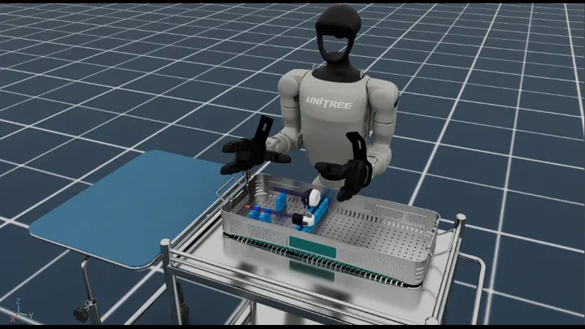
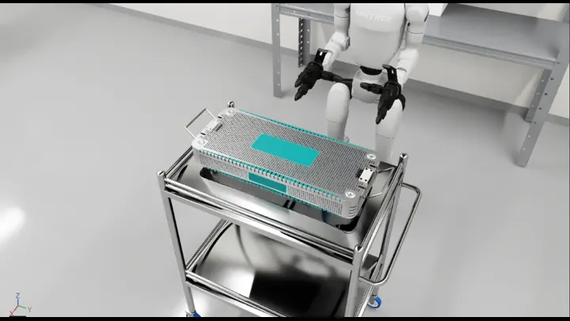
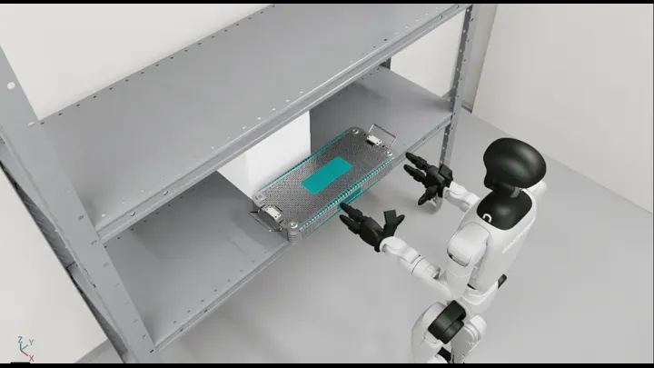
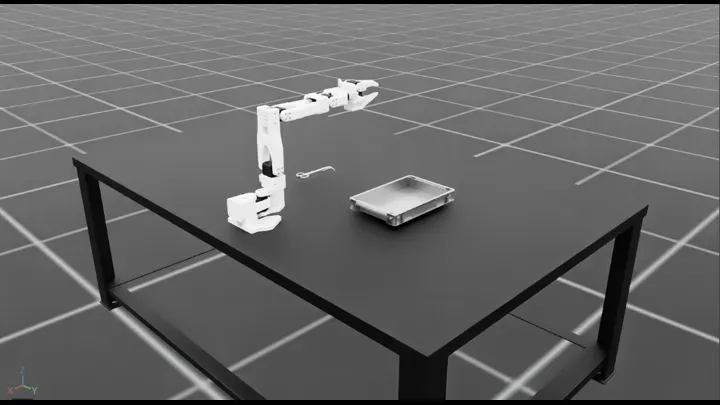

# Hospital Automation Robotics Workflows

Workflows for robotic manipulation, transport, and procedural support in hospital environments.

## Workflows

| Workflow | Demonstration | Supported modes ([guide](../../i4h_workflow_modes/README.md)) |
| --- | --- | --- |
| [`assemble_trocar`](assemble_trocar.py) | Lift, align, insert, place, and release a trocar with a Unitree G1. | `policy`, `replay`, `idle` |
| [`locomanip_push_cart`](locomanip_push_cart.py) | Walk to a cart, grip it, and push it forward with a Unitree G1. | `policy`, `teleop`, `replay`, `idle` |
| [`locomanip_tray_pick_and_place`](locomanip_tray_pick_and_place.py) | Move a surgical tray from a shelf to a cart with a Unitree G1. | `policy`, `teleop`, `replay`, `idle` |
| [`scissor_pick_and_place`](scissor_pick_and_place.py) | Pick up surgical scissors, place them in a tray, and return an SO-ARM 101 home. | `policy`, `policy_n17`, `rule-based`, `teleop`, `replay`, `idle` |

`policy_n17` is a workflow-specific extension for an alternative policy stack.

## Demonstrations

Open a preview to view the animated demonstration.

| [`assemble_trocar`](assemble_trocar.py) | [`locomanip_push_cart`](locomanip_push_cart.py) |
| :---: | :---: |
| [](../../../docs/workflows/images/assemble_trocar.gif) | [](../../../docs/workflows/images/locomanip_push_cart.gif) |

| [`locomanip_tray_pick_and_place`](locomanip_tray_pick_and_place.py) | [`scissor_pick_and_place`](scissor_pick_and_place.py) |
| :---: | :---: |
| [](../../../docs/workflows/images/locomanip_tray_pick_and_place.gif) | [](../../../docs/workflows/images/scissor_pick_and_place.gif) |

Note: Complete the [project setup](../../../README.md#setup-from-the-command-line) before you begin.

## Run with an AI Agent

Paste any prompt into Claude Code, Codex, or the repository's [Local Agent](../../../local-agent/README.md):

```text
Evaluate trocar assembly for 1 episode.

Evaluate locomanip push cart for 1 episode.

Evaluate locomanip tray pick and place for 1 episode.

Evaluate scissor pick and place for 1 episode.
```

The agent runs the selected workflow, verifies the episode result, and inspects its recorded artifacts.

## Run from the Command Line

```bash
# Assemble a trocar with the GR00T N1.5 policy.
./run.sh assemble_trocar --policy

# Push a cart with the GR00T N1.6 policy.
./run.sh locomanip_push_cart --policy

# Move a tray with the GR00T N1.6 policy.
./run.sh locomanip_tray_pick_and_place --policy

# Pick and place scissors with the rule-based controller.
./run.sh scissor_pick_and_place --rule-based

# Control the scissor workflow with the keyboard.
./run.sh scissor_pick_and_place --teleop
```

## Assemble Trocar RL Post-training

Start with either an existing GR00T N1.5 checkpoint or [NVIDIA's pretrained model](https://huggingface.co/nvidia/GR00T-N1.5-3B).

### Train with an AI Agent

```text
RL post-train assemble_trocar with this checkpoint:
  /absolute/path/to/gr00t-checkpoint
Evaluate and export the result, then validate the workflow.

RL post-train assemble_trocar with NVIDIA's pretrained GR00T N1.5 3B
  checkpoint from Hugging Face.
Evaluate and export the result, then validate the workflow.
```

The agent dry-runs, trains, evaluates, exports, and validates the policy.

### Train from the Command Line

Choose a starting checkpoint, then run the training preflight:

```bash
# Option 1: use an existing downloaded checkpoint.
GR00T_MODEL_DIR=/absolute/path/to/gr00t-checkpoint

# Option 2: download NVIDIA's pretrained model.
# tasks/gr00t_n15/.venv/bin/hf download nvidia/GR00T-N1.5-3B \
#   --local-dir ./data/models/GR00T-N1.5-3B
# GR00T_MODEL_DIR="$PWD/data/models/GR00T-N1.5-3B"

./train.sh rl assemble_trocar \
  --model-path "$GR00T_MODEL_DIR" \
  --num-envs 64 \
  --epochs 1000 \
  --dry-run
```

The pretrained model is a starting checkpoint, not a trained Trocar policy.

Trocar training requires two visible GPUs: one for GR00T N1.5/RLinf and one for Isaac Sim/Arena. After the dry run passes, remove `--dry-run` to train. Then evaluate and export the generated run bundle:

```bash
# Copy the timestamped run directory printed by the training command.
TRAIN_RUN="$PWD/runs/assemble_trocar/YYYYMMDD_HHMMSS"

./train.sh rl assemble_trocar \
  --eval \
  --checkpoint "$TRAIN_RUN" \
  --video
./train.sh rl export assemble_trocar \
  --checkpoint "$TRAIN_RUN" \
  --output-dir "$TRAIN_RUN/exported"
./run.sh assemble_trocar --policy \
  --checkpoint "$TRAIN_RUN/exported"
```

RLinf PPO post-training is a separate training lifecycle, not a workflow run mode.
