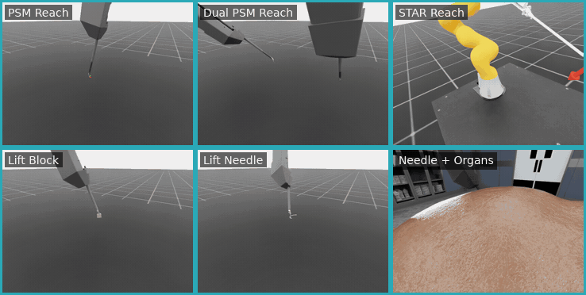

# Laparoscopic Robotics Workflows

These workflows use dVRK PSM or STAR robots for laparoscopic manipulation and instrument positioning.

## Workflows

| Workflow | Demonstration | Supported modes ([guide](../../i4h_workflow_modes/README.md)) |
| --- | --- | --- |
| [`surgical_reach_psm`](surgical_reach_psm.py) | One dVRK PSM reaches a target. | `rule-based`, `replay`, `idle` |
| [`surgical_reach_dual_psm`](surgical_reach_dual_psm.py) | Two dVRK PSM arms reach separate targets in parallel. | `rule-based`, `replay`, `idle` |
| [`surgical_reach_star`](surgical_reach_star.py) | A STAR arm reaches a target. | `rule-based`, `replay`, `idle` |
| [`surgical_lift_block`](surgical_lift_block.py) | A dVRK PSM grasps and lifts a peg-transfer block. | `rule-based`, `replay`, `idle` |
| [`surgical_lift_needle`](surgical_lift_needle.py) | A dVRK PSM grasps and lifts a suture needle. | `rule-based`, `replay`, `idle` |
| [`surgical_lift_needle_organs`](surgical_lift_needle_organs.py) | A dVRK PSM lifts a suture needle from an organ bed. | `rule-based`, `replay`, `idle` |

## Demonstrations

Open the preview to view the animated demonstration.

| Rule-based workflow evaluations |
| :---: |
| [](../../../docs/workflows/images/surgical-workflows.gif) |

Note: Complete the [project setup](../../../README.md#setup-from-the-command-line) before you begin.

## Run with an AI Agent

Paste any prompt into Claude Code, Codex, or the repository's [Local Agent](../../../local-agent/README.md):

```text
Run surgical_reach_psm in rule-based mode for 1 episode.

Run surgical_reach_dual_psm in rule-based mode for 1 episode.

Run surgical_reach_star in rule-based mode for 1 episode.

Run surgical_lift_block in rule-based mode for 1 episode.

Run surgical_lift_needle in rule-based mode for 1 episode.

Run surgical_lift_needle_organs in rule-based mode for 1 episode.
```

The agent runs the selected workflow, verifies the episode result, and inspects its recorded artifacts.

## Run from the Command Line

```bash
# Reach a target with one dVRK PSM.
./run.sh surgical_reach_psm --rule-based

# Reach two targets with two dVRK PSM arms.
./run.sh surgical_reach_dual_psm --rule-based

# Reach a target with a STAR arm.
./run.sh surgical_reach_star --rule-based

# Lift a peg-transfer block.
./run.sh surgical_lift_block --rule-based

# Lift a suture needle.
./run.sh surgical_lift_needle --rule-based

# Lift a suture needle from an organ bed.
./run.sh surgical_lift_needle_organs --rule-based
```

## 📚 Citations

This workflow originated from the [ORBIT-Surgical](https://orbit-surgical.github.io/) framework. If you use it in academic publications, please cite:

```text
@inproceedings{ORBIT-Surgical,
  author={Yu, Qinxi and Moghani, Masoud and Dharmarajan, Karthik and Schorp, Vincent and Panitch, William Chung-Ho and Liu, Jingzhou and Hari, Kush and Huang, Huang and Mittal, Mayank and Goldberg, Ken and Garg, Animesh},
  booktitle={2024 IEEE International Conference on Robotics and Automation (ICRA)},
  title={ORBIT-Surgical: An Open-Simulation Framework for Learning Surgical Augmented Dexterity},
  year={2024},
  pages={15509-15516},
  doi={10.1109/ICRA57147.2024.10611637}
}

@inproceedings{SuFIA-BC,
  author={Moghani, Masoud and Nelson, Nigel and Ghanem, Mohamed and Diaz-Pinto, Andres and Hari, Kush and Azizian, Mahdi and Goldberg, Ken and Huver, Sean and Garg, Animesh},
  booktitle={2025 IEEE International Conference on Robotics and Automation (ICRA)},
  title={SuFIA-BC: Generating High Quality Demonstration Data for Visuomotor Policy Learning in Surgical Subtasks},
  year={2025},
  pages={4534--4541},
  publisher={IEEE},
  doi={10.1109/ICRA55743.2025.11127797}
}
```
