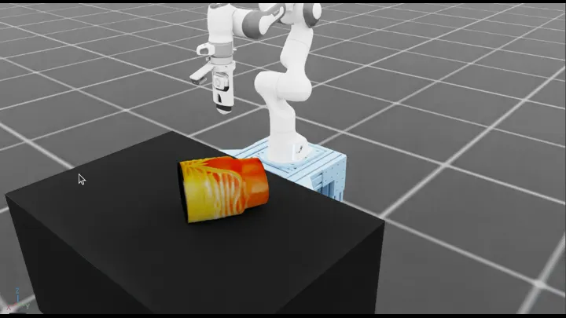

# Ultrasound Robotics Workflows

Workflows for robot-assisted ultrasound probe positioning and scanning.

## Workflows

| Workflow | Demonstration | Supported modes ([guide](../../i4h_workflow_modes/README.md)) |
| --- | --- | --- |
| [`ultrasound_liver_scan`](ultrasound_liver_scan.py) | Move an ultrasound probe across an abdominal phantom. | `policy`, `rule-based`, `teleop`, `replay`, `idle` |
| [`ultrasound_probe_reach`](ultrasound_probe_reach.py) | Align an ultrasound probe with a randomized target. | `policy`, `idle` |

## Demonstrations

Open the preview to view the animated demonstration.

| [`ultrasound_liver_scan`](ultrasound_liver_scan.py) |
| :---: |
| [](../../../docs/workflows/images/ultrasound_liver_scan.gif) |

Note: Complete the [project setup](../../../README.md#setup-from-the-command-line) before you begin.

## Run with an AI Agent

Paste this prompt into Claude Code, Codex, or the repository's [Local Agent](../../../local-agent/README.md):

```text
Evaluate ultrasound_liver_scan for 1 episode.
```

The agent runs the workflow, verifies the episode result, and inspects its recorded artifacts.

## Run from the Command Line

```bash
# Sweep the liver phantom with the rule-based controller.
./run.sh ultrasound_liver_scan --rule-based

# Control the liver-scan probe with the keyboard.
./run.sh ultrasound_liver_scan --teleop
```

## RL Training

`ultrasound_probe_reach` supports the maintained RSL-RL PPO training profile. A trained checkpoint is not included; train and export one before using policy mode.

### Train with an AI Agent

```text
Train ultrasound_probe_reach with RL.
Evaluate 20 episodes and validate the exported policy.
```

The agent dry-runs, trains, evaluates, exports, and validates the policy.

### Train from the Command Line

Run the complete training lifecycle:

```bash
# Inspect the maintained RSL-RL PPO profile.
./train.sh rl show ultrasound_probe_reach

# Dry-run the training configuration.
./train.sh rl ultrasound_probe_reach \
  --num-envs 128 \
  --epochs 400 \
  --dry-run

# Train the policy from scratch.
./train.sh rl ultrasound_probe_reach \
  --num-envs 128 \
  --epochs 400

# Copy the timestamped run directory printed by the training command.
TRAIN_RUN="$PWD/runs/ultrasound_probe_reach/YYYYMMDD_HHMMSS"

# Evaluate the trained checkpoint.
./train.sh rl ultrasound_probe_reach \
  --eval \
  --checkpoint "$TRAIN_RUN/model_final.pt" \
  --episodes 20

# Export the verified policy to TorchScript.
./train.sh rl export ultrasound_probe_reach \
  --checkpoint "$TRAIN_RUN/model_final.pt" \
  --output-dir "$TRAIN_RUN/exported"

# Validate the exported policy through the Workflow.
./run.sh ultrasound_probe_reach --policy \
  --checkpoint "$TRAIN_RUN/exported/policy.pt" \
  --episodes 20
```

RSL-RL training and evaluation are a separate lifecycle, not workflow run modes.
