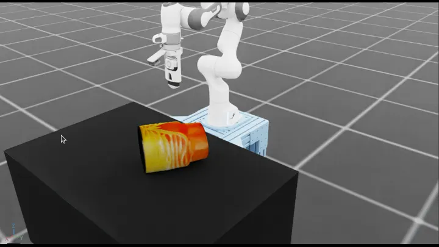

# Ultrasound Robotics Workflows

Workflows for robot-assisted ultrasound probe positioning and scanning.

## Workflows

| Workflow | Demonstration | Supported modes ([guide](../../i4h_workflow_modes/README.md)) |
| --- | --- | --- |
| [`ultrasound_liver_scan`](ultrasound_liver_scan.py) | Move an ultrasound probe across an abdominal phantom. | `policy`, `rule-based`, `validate-ultrasound`, `teleop`, `replay`, `idle` |
| [`ultrasound_probe_reach`](ultrasound_probe_reach.py) | Align an ultrasound probe with a randomized target. | `policy`, `idle` |

## Demonstrations

Open the preview to view the animated demonstration.

| [`ultrasound_liver_scan`](ultrasound_liver_scan.py) |
| :---: |
| [](../../../docs/workflows/images/ultrasound_liver_scan.gif) |

Note: Complete the [project setup](../../../README.md#setup-from-the-command-line) before you begin.

## Run with an AI Agent

Paste this prompt into Claude Code, Codex, or the repository's [Local Agent](../../../local-agent/README.md):

```text
Evaluate ultrasound_liver_scan for 1 episode.
```

The agent runs the workflow, verifies the episode result, and inspects its recorded artifacts.

## Run from the Command Line

```bash
# Sweep the liver phantom with the rule-based controller.
./run.sh ultrasound_liver_scan --rule-based

# Control the liver-scan probe with the keyboard.
./run.sh ultrasound_liver_scan --teleop
```

## RL Training

`ultrasound_probe_reach` supports the maintained RSL-RL PPO training profile. A trained checkpoint is not included; train and export one before using policy mode.

### Train with an AI Agent

```text
Train ultrasound_probe_reach with RL.
Evaluate 20 episodes and validate the exported policy.
```

The agent dry-runs, trains, evaluates, exports, and validates the policy.

### Train from the Command Line

Run the complete training lifecycle:

```bash
# Inspect the maintained RSL-RL PPO profile.
./train.sh rl show ultrasound_probe_reach

# Dry-run the training configuration.
./train.sh rl ultrasound_probe_reach \
  --num-envs 128 \
  --epochs 400 \
  --dry-run

# Train the policy from scratch.
./train.sh rl ultrasound_probe_reach \
  --num-envs 128 \
  --epochs 400

# Copy the timestamped run directory printed by the training command.
TRAIN_RUN="$PWD/runs/ultrasound_probe_reach/YYYYMMDD_HHMMSS"

# Evaluate the trained checkpoint.
./train.sh rl ultrasound_probe_reach \
  --eval \
  --checkpoint "$TRAIN_RUN/model_final.pt" \
  --episodes 20

# Export the verified policy to TorchScript.
./train.sh rl export ultrasound_probe_reach \
  --checkpoint "$TRAIN_RUN/model_final.pt" \
  --output-dir "$TRAIN_RUN/exported"

# Validate the exported policy through the Workflow.
./run.sh ultrasound_probe_reach --policy \
  --checkpoint "$TRAIN_RUN/exported/policy.pt" \
  --episodes 20
```

RSL-RL training and evaluation are a separate lifecycle, not workflow run modes.

## Full patient from `patient_twin.yaml`

Both ultrasound scenes accept `--patient-twin /path/to/patient_twin.yaml`.
Without it, the original torso phantom is used. The manifest must reference an
`anatomy_usd` containing the visible SOMA exterior and liver. All visible internal
meshes are loaded into the native CUDA/OptiX `ultrasound-simulator` acoustic world.
This backend is an optional `arena` extra, selected automatically by `run.sh`
when an ultrasound workflow receives `--patient-twin`.

The simulator requires a CUDA toolkit, compatible C++ compiler, and its native
build dependencies; see the simulator README. For this workstation's CUDA 12.0
and GCC 12, the tested build configuration is:

```bash
export CMAKE_ARGS='-DCMAKE_CUDA_ARCHITECTURES=89 -DCMAKE_CUDA_HOST_COMPILER=/usr/bin/g++-12'
export CMAKE_BUILD_PARALLEL_LEVEL=8
PATIENT=../i4h-digital-twin/patient-digital-twin/examples/data/patient_twin_s0011_soma/patient_twin.yaml

# Open the full patient with the attached probe at skin contact and B-mode window.
./run.sh ultrasound_liver_scan --live --patient-twin "$PATIENT"

# Validate contact, lift 4 cm off the skin, then return; record actual sensor images.
./run.sh ultrasound_liver_scan --mode validate-ultrasound --patient-twin "$PATIENT" \
  --episodes 1 --record /tmp/patient-ultrasound.hdf5 --record-failures

# Move the physical probe interactively; its acoustic image follows its pose.
./run.sh ultrasound_liver_scan --teleop --patient-twin "$PATIENT"
```

The patient is placed supine on a table sized to the SOMA bounds, with the liver
under the Franka workspace. This scene-specific rigid placement replaces the
manifest's fluoroscopy-room world placement; it moves the exterior and every
internal mesh together, preserving their CT registration. Source files are not
modified. Phantom pose randomization is disabled for this fixed patient.

The acoustic frame is calibrated to the HD3 C3 probe mesh: its origin is the
center of the distal face, at TCP-local `(-0.33357, -1.84759, -2.43516)` mm.
Imager X follows TCP -Y, imager Y follows TCP X, and depth follows TCP Z. The
sensor reads the physics `ee_frame` on each update, composes that calibration,
and converts world meters to patient-local millimeters. The reset controller
moves the attached robot probe to the skin over the liver without teleporting it.

The **Ultrasound - Patient B-mode** window shows 384×384 images at up to 10 Hz of
simulation time, with 180 mm depth. Recordings include `obs/ultrasound` RGB
frames alongside room/wrist cameras, robot joints and actions. The sensor also
exposes `b_mode_db`, `probe_pose`, `target_pose`, and `contact_distance_m` through
`scene.sensor_signal`. Pose quaternions in these signals are WXYZ.

Use `validate-ultrasound`, `idle`, or `teleop` for the full patient. Existing
phantom policy checkpoints and the old `rule-based` waypoints are specific to
the torso phantom and are not validated on the full patient. Only one environment
is supported for patient ultrasound. Anatomy remains rigid: the 5 mm acoustic
contact tolerance approximates gel coupling, not tissue deformation or contact
force. Acoustic materials use the simulator's available presets (fat for SOMA,
blood for vessels, bone for skeleton, liver for liver, muscle for other tissue);
these are illustrative values, not patient-specific acoustic measurements.
