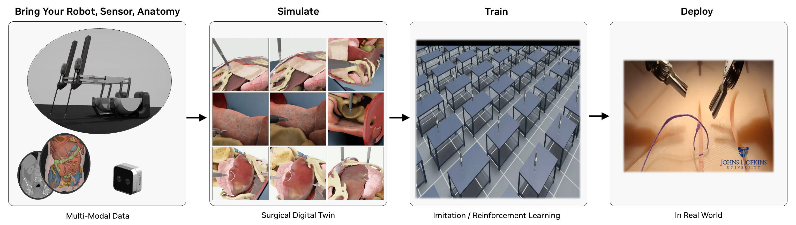

# 🔬 Robotic Surgery Workflow



---

## 🩺 Technical Overview

The Robotic Surgery Workflow is a comprehensive solution designed for healthcare professionals and researchers working in the field of robotic-assisted surgery. This workflow provides a robust framework for simulating, training, and analyzing robotic surgical procedures in a virtual environment. It leverages NVIDIA's ray tracing capabilities to create highly realistic surgical simulations, enabling surgeons to practice complex procedures, researchers to develop new surgical techniques, and medical institutions to enhance their training programs. By offering a safe, controlled environment for surgical practice and research, this workflow helps improve surgical outcomes, reduce training costs, and advance the field of robotic surgery.

The framework supports multiple surgical robots and tasks:

- **dVRK (da Vinci Research Kit)**: Patient Side Manipulator (PSM) for minimally invasive surgery.
- **STAR (Smart Tissue Autonomous Robot)**: Autonomous surgical robot for tissue manipulation.
- **Multi-arm coordination**: Dual-arm surgical robot synchronization.
- **Surgical task simulation**: Needle lifting, suturing, peg transfer, and etc.

---

## 📋 Table of Contents

- [🚀 Quick Start](#-quick-start)
- [⚡ Running Workflows](#-running-workflows)
- [🔧 Detailed Setup Instructions](#-detailed-setup-instructions)
- [🛠️ Troubleshooting](#️-troubleshooting)

---

## 🚀 Quick Start

### ⏱️ Installation Timeline
**Estimated Setup Duration:** 40-60 minutes (network-dependent asset downloads)

### 🔍 System Prerequisites Validation

#### GPU Architecture Requirements
- **NVIDIA GPU**: RT Core-enabled architecture (Ampere or later)
- **Compute Capability**: ≥8.6
- **VRAM**: ≥24GB GDDR6/HBM
- **Unsupported**: A100, H100 (lack RT Cores for ray tracing acceleration)

   <details>
   <summary>🔍 GPU Compatibility Verification</summary>

   ```bash
   nvidia-smi --query-gpu=name,compute_cap --format=csv,noheader
   ```

   Verify output shows compute capability ≥8.6 (Ampere/Ada Lovelace/Hopper with RT Cores)
   </details>

#### Driver & System Requirements
- **Operating System**: Ubuntu 22.04 LTS / 24.04 LTS (x86_64)
- **NVIDIA Driver**: ≥535.129.03 (RTX ray tracing API support)
- **Memory Requirements**: ≥8GB GPU memory, ≥32GB system RAM
- **Storage**: ≥100GB NVMe SSD (asset caching and simulation data)

   <details>
   <summary>🔍 Driver Version Validation</summary>

   ```bash
   nvidia-smi --query-gpu=driver_version --format=csv,noheader,nounits
   ```
   </details>

#### Software Dependencies
- **Python**: 3.10 (exact version required)

---

### 🐍 Conda Environment Setup

The robotic surgery workflow can be installed in a conda-based environment for dependency isolation and compatibility.

**Prerequisites**: Ensure [Miniconda](https://www.anaconda.com/docs/getting-started/miniconda/install) is installed on your system.

#### 1️⃣ Environment Creation
```bash
# Create isolated conda environment
conda create -n robotic_surgery python=3.10 -y
conda activate robotic_surgery
```

#### 2️⃣ Repository Clone & Dependency Installation
```bash
# Clone the repository
git clone https://github.com/isaac-for-healthcare/i4h-workflows.git
cd i4h-workflows

# Install all dependencies (this takes 40-60 minutes)
bash tools/env_setup_robot_surgery.sh
```

**⚠️ Expected Build Time**: The environment setup process takes 40-60 minutes. You may encounter intermediary warnings about conflicting library dependencies - these are non-critical and can be ignored.

#### 3️⃣ Environment Variable Configuration
```bash
# Set PYTHONPATH for current session
export PYTHONPATH=$(pwd)/workflows/robotic_surgery/scripts
```

   <details>
   <summary>💾 Persistent Environment Configuration (Recommended)</summary>

   To avoid setting PYTHONPATH for every new terminal session:

   ```bash
   # Add to your shell profile
   echo "export PYTHONPATH=$(pwd)/workflows/robotic_surgery/scripts:\$PYTHONPATH" >> ~/.bashrc
   source ~/.bashrc
   ```

   This ensures the environment variables are automatically set when you open new terminals.

   **Note:** If you have `robotic_surgery` workflow scripts or previous versions of `robotic_ultrasound` workflow scripts in your `PYTHONPATH`, you can reset it to include only the robotic_ultrasound scripts by running `export PYTHONPATH=$(pwd)/workflows/robotic_ultrasound/scripts`
   </details>


✅ **Installation Complete** - Your robotic surgery simulation environment is ready.

---

## ⚡ Running Workflows

### 🎯 Quick Start Examples

#### 🤖 Basic Robot Control - dVRK PSM Reach
```bash
conda activate robotic_surgery
python workflows/robotic_surgery/scripts/simulation/scripts/environments/state_machine/reach_psm_sm.py
```

**Expected Behavior:**
- Isaac Sim launches with dVRK PSM simulation
- PSM arm moves to predefined target poses

> **⏳ First Run Loading Time**: Initial simulation loading takes 5-10 minutes for asset download and scene initialization. Isaac Sim may appear frozen with no console progress indication - this is normal behavior.

#### 🔬 Surgical Task Simulation - Needle Lifting
```bash
conda activate robotic_surgery
python workflows/robotic_surgery/scripts/simulation/scripts/environments/state_machine/lift_needle_sm.py
```

**Expected Behavior:**
- Isaac Sim launches with robotic surgery simulation
- Surgical simulation with needle manipulation
- Precise grasping and lifting operations

#### 🧠 Reinforcement Learning Training
```bash
conda activate robotic_surgery
# Training (45+ minutes)
python workflows/robotic_surgery/scripts/simulation/scripts/reinforcement_learning/rsl_rl/train.py --task Isaac-Reach-PSM-v0 --headless

# Evaluation/Play mode
python workflows/robotic_surgery/scripts/simulation/scripts/reinforcement_learning/rsl_rl/play.py --task Isaac-Reach-PSM-Play-v0
```

**Expected Behavior:**
- RSL-RL agent training with GPU acceleration
- TensorBoard logging for training progress monitoring
- Trained model evaluation in simulation environment

---

### 🎯 Workflow Component Matrix

| Category | Script | Usage Scenario | Purpose | Documentation | Key Requirements | Expected Runtime |
|----------|--------|----------------|---------|---------------|------------------|------------------|
| **🚀 Basic Control** | [reach_psm_sm.py](scripts/simulation/scripts/environments/state_machine/reach_psm_sm.py) | First-time users, basic robot control | Single-arm dVRK PSM reaching tasks | [State Machine README](scripts/simulation/scripts/environments/state_machine/README.md#dvrk-psm-reach) | Isaac Lab | 2-5 minutes |
| **🤖 Dual-Arm Control** | [reach_dual_psm_sm.py](scripts/simulation/scripts/environments/state_machine/reach_dual_psm_sm.py) | First-time users, basic robot control | Dual-arm dVRK PSM coordination | [State Machine README](scripts/simulation/scripts/environments/state_machine/README.md#dual-arm-dvrk-psm-reach) | Isaac Lab | 2-5 minutes |
| **⭐ STAR Robot** | [reach_star_sm.py](scripts/simulation/scripts/environments/state_machine/reach_star_sm.py) | First-time users, basic robot control | STAR robot reaching demonstrations | [State Machine README](scripts/simulation/scripts/environments/state_machine/README.md#star-reach) | Isaac Lab | 2-5 minutes |
| **🪡 Needle Manipulation** | [lift_needle_sm.py](scripts/simulation/scripts/environments/state_machine/lift_needle_sm.py) | First-time users, basic robot control | Suture needle lifting and manipulation | [State Machine README](scripts/simulation/scripts/environments/state_machine/README.md#suture-needle-lift) | Isaac Lab | 3-7 minutes |
| **🫁 Realistic OR Simulation** | [lift_needle_organs_sm.py](scripts/simulation/scripts/environments/state_machine/lift_needle_organs_sm.py) | Realistic surgical simulation in an operating room | Needle lifting | [State Machine README](scripts/simulation/scripts/environments/state_machine/README.md#organs-suture-needle-lift) | Isaac Lab | 3-7 minutes |
| **🧩 Peg Transfer** | [lift_block_sm.py](scripts/simulation/scripts/environments/state_machine/lift_block_sm.py) | First-time users, basic robot control | Peg transfer surgical training task | [State Machine README](scripts/simulation/scripts/environments/state_machine/README.md#peg-block-lift) | Isaac Lab | 2-5 minutes |
| **🧠 RL Training** | [train.py](scripts/simulation/scripts/reinforcement_learning/rsl_rl/train.py) | AI model development | Reinforcement learning agent training | [RSL-RL README](scripts/simulation/scripts/reinforcement_learning/rsl_rl/README.md#training-and-playing) | Isaac Lab | 45+ minutes |
| **🎮 RL Evaluation** | [play.py](scripts/simulation/scripts/reinforcement_learning/rsl_rl/play.py) | Model validation | Trained agent evaluation and visualization | [RSL-RL README](scripts/simulation/scripts/reinforcement_learning/rsl_rl/README.md#training-and-playing) | Isaac Lab, trained model | 5-10 minutes |

---

### 🎓 Understanding the Workflow Architecture

```
Isaac Sim Environment
├── Robots (dVRK PSM, STAR)
├── Surgical Instruments (needles, pegs, operating room equipment)
├── Anatomical Models (organs)
└── Control Systems (state machines, RL)
```

---

## 🔧 Detailed Setup Instructions

<details>
<summary>📋 Advanced Configuration & Dependencies</summary>

### 🏗️ Framework Architecture Dependencies

The robotic surgery workflow is built on the following core dependencies:
- [IsaacSim 4.5.0](https://docs.isaacsim.omniverse.nvidia.com/4.5.0/index.html)
- [IsaacLab 2.1.0](https://isaac-sim.github.io/IsaacLab/v2.1.0/index.html)
- [RSL-RL](https://github.com/leggedrobotics/rsl_rl) for reinforcement learning

### 🐳 Docker Installation Procedures

Please refer to the [Robotic Ultrasound Docker Container Guide](./docker/README.md) for detailed instructions on how to run the workflow in a Docker container.

### 🔨 Conda Installation Procedures

#### 1️⃣ NVIDIA Graphics Driver Installation
Install or upgrade to the latest NVIDIA driver from [NVIDIA website](https://www.nvidia.com/en-us/drivers/)

**Note**: The workflow requires driver version ≥555 for ray tracing capabilities.

#### 2️⃣ Conda Installation
Install Miniconda following the [official guide](https://www.anaconda.com/docs/getting-started/miniconda/install):

```bash
# Download and install Miniconda
wget https://repo.anaconda.com/miniconda/Miniconda3-latest-Linux-x86_64.sh
bash Miniconda3-latest-Linux-x86_64.sh
```

#### 3️⃣ Environment Creation and Setup
```bash
# Create and activate environment
conda create -n robotic_surgery python=3.10 -y
conda activate robotic_surgery

# Clone repository and install dependencies
git clone https://github.com/isaac-for-healthcare/i4h-workflows.git
cd i4h-workflows
bash tools/env_setup_robot_surgery.sh
```

#### 4️⃣ Environment Variable Configuration
```bash
# Current session
export PYTHONPATH=$(pwd)/workflows/robotic_surgery/scripts:$PYTHONPATH

# Persistent configuration (recommended)
echo "export PYTHONPATH=$(pwd)/workflows/robotic_surgery/scripts:\$PYTHONPATH" >> ~/.bashrc
source ~/.bashrc
```

### 📦 Asset Management

#### Automated Asset Retrieval
Assets are automatically downloaded when running workflows for the first time.

#### Manual Asset Retrieval
```bash
# Download all assets (65GB, 30-60 minutes)
i4h-asset-retrieve
```

**Asset Storage**: `~/.cache/i4h-assets/<sha256>/`

</details>

---

## 🛠️ Troubleshooting

### ⚠️ Common Issues

#### 🐌 Long Loading Times
**Symptoms**: Isaac Sim appears frozen during initial loading
**Resolution**: This is expected behavior. Initial loading takes 5-10 minutes with no progress indication. Be patient and avoid force-closing the application.

#### 🔗 Module Import Errors
**Symptoms**: `ModuleNotFoundError` when running scripts
**Resolution**: Ensure `PYTHONPATH` includes the scripts directory:
```bash
export PYTHONPATH=$(pwd)/workflows/robotic_surgery/scripts
```

#### 🔧 Environment Build Issues
**Symptoms**: Conflicting library dependency warnings during setup
**Resolution**: These warnings are non-critical and can be ignored. The environment will function correctly.

### 🆘 Support Resources

- **Issue Tracking**: [GitHub Issues](https://github.com/isaac-for-healthcare/i4h-workflows/issues)
