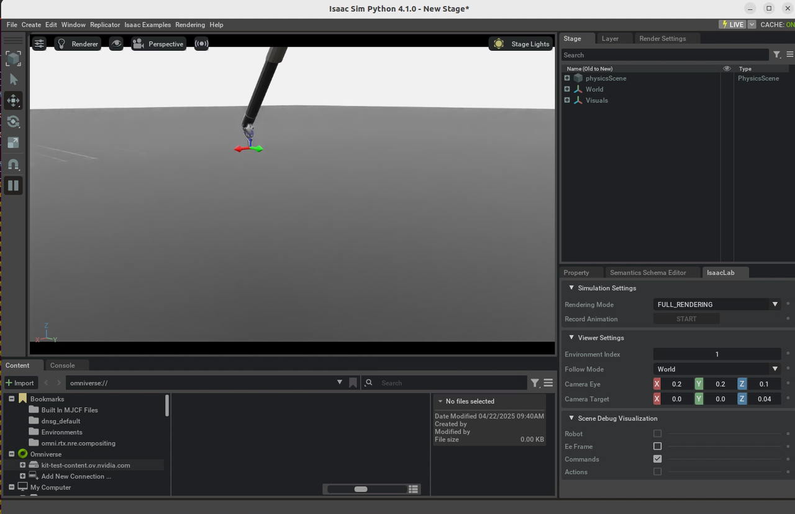
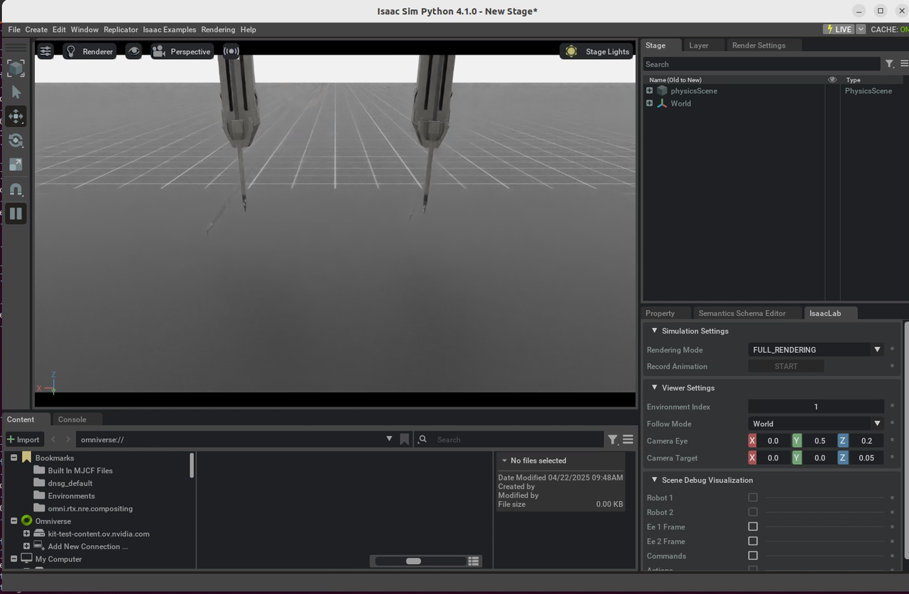
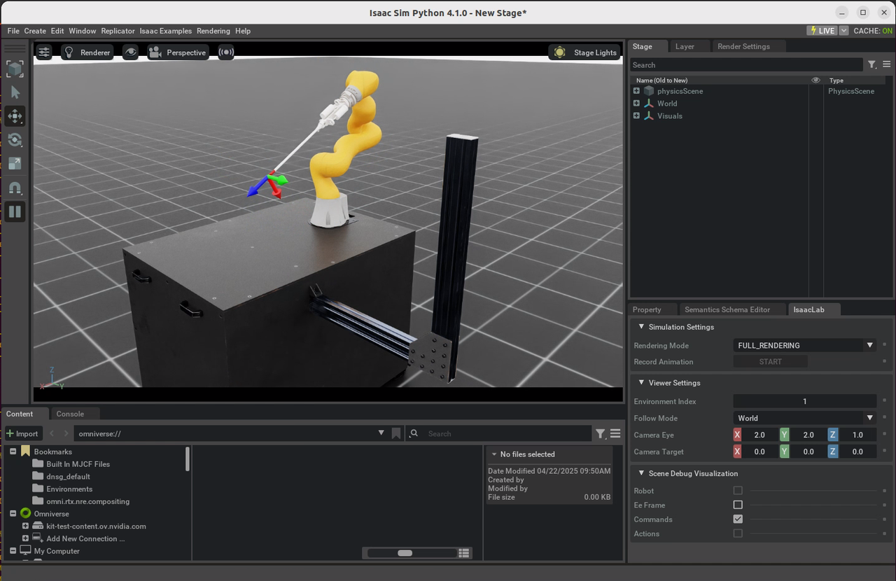
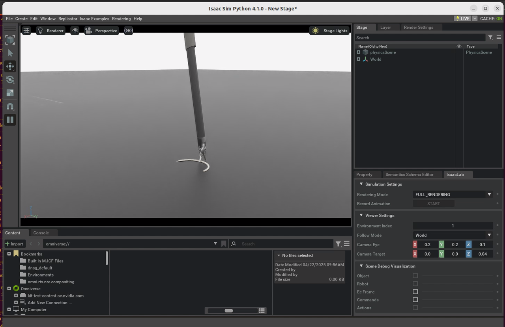
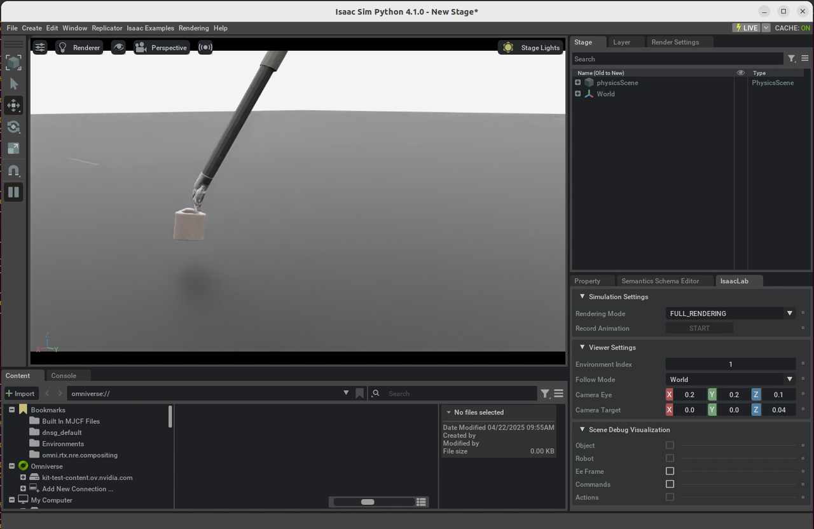

# Isaac for Healthcare - Robotic Surgery


## Overview

Robotic Surgery is a physics-based surgical robot simulation framework with photorealistic rendering in NVIDIA Omniverse. Robotic Surgery leverages GPU parallelization to train reinforcement learning and imitation learning algorithms to facilitate study of robot learning to augment human surgical skills.


## Setup

Please refer to the [README](../../README.md#environment-setup) for instructions on how to install the dependencies.

## Robotic Surgery Tasks

We provide examples on hand-crafted state machines for the robotic surgery environments, demonstrating the execution of surgical subtasks.
| Id  | Task                      | Description                                                                                         | Python Command                                                                                              | Screenshot                                   |
|------|---------------------------|-------------------------------------------------------------------------------------------------|-------------------------------------------------------------------------------------------------------------|----------------------------------------------|
| 1    | **dVRK-PSM Reach**        | da Vinci Research Kit (dVRK) Patient Side Manipulator (PSM) to reach a desired pose               | python workflows/robotic_surgery/scripts/simulation/scripts/environments/state_machine/reach_psm_sm.py     |                     |
| 2    | **Dual-arm dVRK-PSM Reach** | dual-arm dVRK-PSM to reach a desired pose                                                       | `python workflows/robotic_surgery/scripts/simulation/scripts/environments/state_machine/reach_dual_psm_sm.py` |            |
| 3    | **STAR Reach**            | STAR arm to reach a desired pose                                                                 | `python workflows/robotic_surgery/scripts/simulation/scripts/environments/state_machine/reach_star_sm.py`    |                   |
| 4    | **Suture Needle Lift**    | lift a suture needle to a desired pose                                                          | `python workflows/robotic_surgery/scripts/simulation/scripts/environments/state_machine/lift_needle_sm.py`   |           |
| 5    | **Organs Suture Needle Lift** | lift a suture needle from an organ to a desired pose in the operating room                     | `python workflows/robotic_surgery/scripts/simulation/scripts/environments/state_machine/lift_needle_organs_sm.py` |    |
| 6    | **Peg Block Lift**        | lift a peg block to a desired pose                                                               | `python workflows/robotic_surgery/scripts/simulation/scripts/environments/state_machine/lift_block_sm.py`    |               |


## Reinforcement Learning

Train an agent with [RSL-RL](https://github.com/leggedrobotics/rsl_rl):

- **dVRK-PSM Reach (`Isaac-Reach-PSM-v0`)**:
```bash
# run script for training
python workflows/robotic_surgery/scripts/simulation/scripts/reinforcement_learning/rsl_rl/train.py --task Isaac-Reach-PSM-v0 --headless
# run script for playing with 50 environments
python workflows/robotic_surgery/scripts/simulation/scripts/reinforcement_learning/rsl_rl/play.py --task Isaac-Reach-PSM-Play-v0
```

- **Suture Needle Lift (`Isaac-Lift-Needle-PSM-IK-Rel-v0`)**:

```bash
# run script for training
python workflows/robotic_surgery/scripts/simulation/scripts/reinforcement_learning/rsl_rl/train.py --task Isaac-Lift-Needle-PSM-IK-Rel-v0 --headless
# run script for playing with 50 environments
python workflows/robotic_surgery/scripts/simulation/scripts/reinforcement_learning/rsl_rl/play.py --task Isaac-Lift-Needle-PSM-IK-Rel-Play-v0
```

### TensorBoard: TensorFlow's visualization toolkit

Monitor the training progress stored in the `logs` directory on [Tensorboard](https://www.tensorflow.org/tensorboard):

```bash
# execute from the root directory of the repository
python -m tensorboard.main --logdir=logs
```
