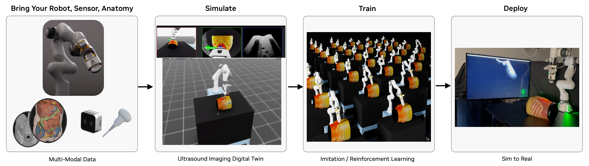

# Robotic Ultrasound Workflow

## System Requirements

- Ubuntu 22.04
- NVIDIA GPU with compute capability 8.6 and 32GB of memory
    - GPUs without RT Cores (A100, H100) are not supported.
- NVIDIA Driver Version >= 555
- 50GB of disk space

## Environment Setup

The robotic ultrasound workflow is built on the following dependencies:
- [IsaacSim 4.5.0](https://docs.isaacsim.omniverse.nvidia.com/4.5.0/index.html)
- [IsaacLab 2.0.2](https://isaac-sim.github.io/IsaacLab/v2.0.2/index.html)
- [openpi](https://github.com/Physical-Intelligence/openpi) and [lerobot](https://github.com/huggingface/lerobot)
- [Raytracing Ultrasound Simulator](https://github.com/isaac-for-healthcare/i4h-sensor-simulation/tree/main/ultrasound-raytracing)

### Install NVIDIA Driver

Install or upgrade to the latest NVIDIA driver from [NVIDIA website](https://www.nvidia.com/en-us/drivers/)

**NOTE**: [Raytracing Ultrasound Simulator](https://github.com/isaac-for-healthcare/i4h-sensor-simulation/tree/main/ultrasound-raytracing) requires driver version >= 555.


### Install CUDA

Install CUDA from [NVIDIA CUDA Quick Start Guide](https://docs.nvidia.com/cuda/cuda-quick-start-guide/index.html)

**NOTE**: [Raytracing Ultrasound Simulator](https://github.com/isaac-for-healthcare/i4h-sensor-simulation/tree/main/ultrasound-raytracing) requires CUDA version >= 12.6.


### Obtain license of RTI DDS

RTI DDS is the common communication package for all the scripts, please refer to [DDS website](https://www.rti.com/products) for registration. You will need to obtain a license file for the RTI DDS and set the `RTI_LICENSE_FILE` environment variable to the path of the license file.


### Install Dependencies

#### Create a new conda environment

Conda is suggested for virtual environment setup, install `Miniconda` from [Miniconda website](https://docs.anaconda.com/miniconda/install/#quick-command-line-install) and create a new virtual environment with Python 3.10.

```sh
# Create a new conda environment
conda create -n robotic_ultrasound python=3.10 -y
# Activate the environment
conda activate robotic_ultrasound
```

#### Install the Raytracing Ultrasound Simulator
To use the ultrasound-raytracing simulator, you can choose one of the following options:
- (experimental) Download the pre-release version from [here](https://github.com/isaac-for-healthcare/i4h-sensor-simulation/releases/tag/v0.1.0) and extract the folder to `workflows/robotic_ultrasound/scripts/raysim`.

- (recommended) Install and build it by following the instructions in [Raytracing Ultrasound Simulator](https://github.com/isaac-for-healthcare/i4h-sensor-simulation/tree/main/ultrasound-raytracing#installation).


#### Install All Dependencies

You can install all the dependencies by running the following command:

```bash
cd <path-to-i4h-workflows>
bash tools/env_setup_robot_us.sh
```

- **NOTE**: It is expected to see the following messages with `pytorch` version mismatch.
```
ERROR: pip's dependency resolver does not currently take into account all the packages that are installed. This behaviour is the source of the following dependency conflicts.
isaaclab 0.34.9 requires torch==2.5.1, but you have torch 2.6.0 which is incompatible.
isaaclab-rl 0.1.0 requires torch==2.5.1, but you have torch 2.6.0 which is incompatible.
isaaclab-tasks 0.10.24 requires torch==2.5.1, but you have torch 2.6.0 which is incompatible.
rl-games 1.6.1 requires wandb<0.13.0,>=0.12.11, but you have wandb 0.19.9 which is incompatible.
```
This is due to requirements of `isaaclab` and `openpi` used different fixed versions of `pytorch`. You can ignore these conflicts.


### Download the I4H assets

Use the following command will download the assets to the `~/.cache/i4h-assets/<sha256>` directory.
Please refer to the [Asset Container Helper](https://github.com/isaac-for-healthcare/i4h-asset-catalog/blob/v0.1.0/docs/catalog_helper.md) for more details.

```sh
i4h-asset-retrieve
```

- **NOTE**: Downloading the assets is a blocking function, so the following warning is expected:

```sh
[108,322ms] [Warning] [omni.client.python] Detected a blocking function. This will cause hitches or hangs in the UI. Please switch to the async version:
  File "<path>/bin/i4h-asset-retrieve", line 8, in <module>
  File "<path>/i4h_asset_helper/cli.py", line 47, in retrieve_main
  File "<path>/i4h_asset_helper/assets.py", line 120, in retrieve_asset
  File "<path>/omni/extscore/omni.client/omni/client/__init__.py", line 610, in read_fil
```
After the assets are downloaded, you will see the following message:
```sh
Assets downloaded to: <user-home-directory>/.cache/i4h-assets/<SHA256>
```


### Set environment variables before running the scripts
Make sure both `PYTHONPATH` and `RTI_LICENSE_FILE` are set:
```sh
export PYTHONPATH=`<path-to-i4h-workflows>/workflows/robotic_ultrasound/scripts`
export RTI_LICENSE_FILE=<path-to-rti-license-file>
```

The `PYTHONPATH` is used to find the modules under the [`scripts`](./scripts) directory.

## Run the scripts

The robotic ultrasound workflow provides several example scripts demonstrating the ultrasound raytracing simulation, holoscan apps, policy model runner, training, and etc.

Navigate to these sub-directories and run the scripts.

- [Holoscan Apps](./scripts/holoscan_apps)
- [Policy Runner](./scripts/policy_runner)
- [Simulation](./scripts/simulation)
- [Training](./scripts/training)
- [Visualization Utilities](./scripts/utils)

Please note that you may need to simultaneously run multiple scripts in different sub-directories to complete the entire workflow. For example, you need to have 4 different terminals running the visualization, policy runner, the sim_with_dds and ultrasound raytracing simulations.
