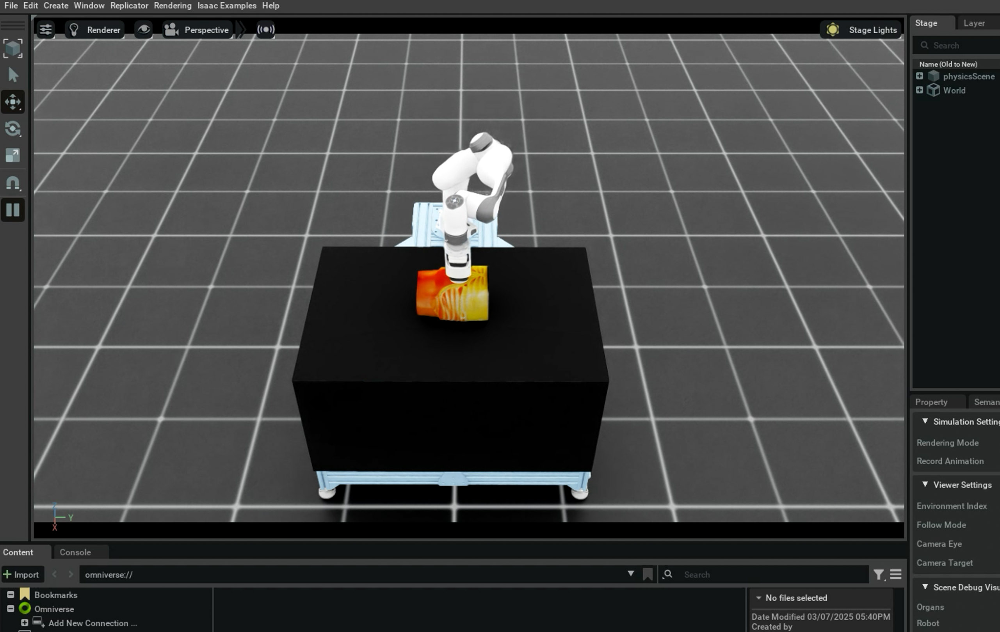

# IsaacLab simulation for robotic ultrasound

## Table of Contents
- [Requirements](#requirements)
- [Installation](#installation)
- [Environments](#environments)
- [Apps](#apps)
  - [PI Zero Policy Evaluation](#pi-zero-policy-evaluation)
  - [Policy Evaluation w/ DDS](#policy-evaluation-w-dds)
  - [Liver Scan State Machine](#liver-scan-state-machine)

# Requirements

Follow [instructions](https://isaac-sim.github.io/IsaacLab/main/source/setup/installation/pip_installation.html) to install IsaacLab. TLDR;

First of all, create a python virtual environment, referring to the [Setup Doc](../README.md), then execute:
```sh
# Upgrade pip
pip install --upgrade pip
# Install IsaacSim
pip install isaacsim==4.2.0.2 isaacsim-extscache-physics==4.2.0.2 isaacsim-extscache-kit==4.2.0.2 isaacsim-extscache-kit-sdk==4.2.0.2 --extra-index-url https://pypi.nvidia.com
# Install Isaac Lab outside of the repo
cd <some workspace>
git clone git@github.com:isaac-sim/IsaacLab.git
cd IsaacLab
# Checkout v1.4.1
git checkout v1.4.1
# Patch (temporary workaround for Isaacsim 4.2 + IsaacLab 1.4.1)
sed -i 's/rsl-rl/rsl-rl-lib/g' source/extensions/omni.isaac.lab_tasks/setup.py
# Install dependencies
sudo apt install cmake build-essential
# Install Isaac Lab
./isaaclab.sh --install
# Test installation
python source/standalone/tutorials/00_sim/create_empty.py
```

# Installation

Follow the [Installation](#installation) instructions below to install the extension.

From the root directory, run:

```sh
# Activate the environment
conda activate robotic_ultrasound
# Ensure toml is installed
pip install toml
# Install the environments
cd <repo root>/workflows/robotic_ultrasound/scripts/simulation
python -m pip install -e exts/robotic_us_ext
```

# Environments

Isaac-Lab scripts usually receive a `--task <task_name>` argument. This argument is used to select the environment/task to be run.
These tasks are detected by the `gym.register` function in the [exts/robotic_us_ext/\__init__.py](exts/robotic_us_ext/robotic_us_ext/tasks/ultrasound/approach/config/franka/__init__.py).

These registered tasks are then further defined in the [environment configuration file](exts/robotic_us_ext/robotic_us_ext/tasks/ultrasound/approach/config/franka/franka_manager_rl_env_cfg.py).

Available tasks:
- `Isaac-Teleop-Torso-FrankaUsRs-IK-RL-Rel-v0`: FrankaUsRs with relative actions
- `Isaac-Reach-Torso-FrankaUsRs-IK-RL-Abs-v0` : FrankaUsRs with absolute actions

Currently there are these robot configurations that can be used in various tasks


| Robot name                                 | task             | applications          |
|----------                                  |---------         |----------             |
| FRANKA_PANDA_REALSENSE_ULTRASOUND_CFG      | \*-FrankaUsRs-*  | Reach, Teleop         |

# Apps

## PI Zero Policy Evaluation
Set up `openpi` referring to [PI0 runner](../policy_runner/README.md).

Move to the [scripts](../) folder and specify python path:
```sh
export PYTHONPATH=`pwd`
```

5. Return to this folder and run the following command:
```sh
python environments/state_machine/pi0_policy/eval.py \
    --task Isaac-Teleop-Torso-FrankaUsRs-IK-RL-Rel-v0 \
    --enable_camera \
    --ckpt_path <path to ckpt>/pi0_aortic_scan_v0.3/19000 \
    --repo_id hf/chiron_aortic
```
This should open a stage with Franka arm and run the robotic ultrasound actions:


## Policy Evaluation w/ DDS
This example should work together with the `pi0 policy runner` via DDS communication,
so please ensure to launch the `run_policy.py` with `height=224`, `width=224`,
and the same `domain id` as this example in another terminal.

When `run_policy.py` is launched and idle waiting for the data,
move to the [scripts](../) folder and specify the python path:
```sh
export PYTHONPATH=`pwd`
```
Then move back to this folder and execute:
```sh
python examples/sim_with_dds.py \
    --task Isaac-Teleop-Torso-FrankaUsRs-IK-RL-Rel-v0 \
    --enable_camera \
    --infer_domain_id <domain id> \
    --viz_domain_id <domain id> \
    --rti_license_file <path to>/rti_license.dat
```

## Liver Scan State Machine

The Liver Scan State Machine provides a structured approach to performing ultrasound scans on a simulated liver. It implements a state-based workflow that guides the robotic arm through the scanning procedure.

### Overview

The state machine transitions through the following states:
- **SETUP**: Initial positioning of the robot
- **APPROACH**: Moving toward the organ
- **CONTACT**: Making contact with the organ surface
- **SCANNING**: Performing the ultrasound scan
- **DONE**: Completing the scan procedure

The state machine integrates multiple control modules:
- **Force Control**: Manages contact forces during scanning
- **Orientation Control**: Maintains proper probe orientation
- **Path Planning**: Guides the robot through the scanning trajectory

### Requirements

- This implementation works **only with a single environment** (`--num_envs 1`).
- It should be used with the `Isaac-Teleop-Torso-FrankaUsRs-IK-RL-Rel-v0` environment.

### Usage

move to the [scripts](../) folder and specify the python path:
```sh
export PYTHONPATH=`pwd`
```
Then move back to this folder and execute:

```sh
python environments/state_machine/liver_scan_sm.py \
    --task Isaac-Teleop-Torso-FrankaUsRs-IK-RL-Rel-v0 \
    --enable_camera
```

### Data Collection

To run the state machine and collect data for a specified number of episodes:

```sh
python environments/state_machine/liver_scan_sm.py \
    --task Isaac-Teleop-Torso-FrankaUsRs-IK-RL-Rel-v0 \
    --enable_camera \
    --num_episodes 2
```

This will collect data for 2 complete episodes and store it in HDF5 format.

### Command Line Arguments

| Argument | Type | Default | Description |
|----------|------|---------|-------------|
| `--task` | str | None | Name of the task (environment) to use |
| `--num_episodes` | int | 0 | Number of episodes to collect data for (0 = no data collection) |
| `--camera_names` | list[str] | ["room_camera", "wrist_camera"] | List of camera names to capture images from |
| `--disable_fabric` | flag | False | Disable fabric and use USD I/O operations |
| `--num_envs` | int | 1 | Number of environments to spawn (must be 1 for this script) |
| `--reset_steps` | int | 15 | Number of steps to take during environment reset |
| `--max_steps` | int | 350 | Maximum number of steps before forcing a reset |

### Data Collection Details

When data collection is enabled (`--num_episodes > 0`), the state machine will:

1. Create a timestamped directory in `./data/hdf5/` to store the collected data
2. Record observations, actions, and state information at each step
3. Capture RGB and depth images from the specified cameras
4. Store all data in HDF5 format compatible with robomimic

The collected data includes:
- Robot observations (position, orientation)
- Torso observations (organ position, orientation)
- Relative and absolute actions
- State machine state
- Joint positions
- Camera images

## Keyboard Controls

During execution, you can press the 'r' key to reset the environment and state machine.

# Teleoperation

The teleoperation interface allows direct control of the robotic arm using various input devices. It supports keyboard, SpaceMouse, and gamepad controls for precise manipulation of the ultrasound probe.

## Setup

Follow the same setup steps as before to ensure your environment is properly configured.

## Running Teleoperation

Basic teleoperation can be started with:

```sh
python environments/teleoperation/teleop_se3_agent.py \
    --task Isaac-Teleop-Torso-FrankaUsRs-IK-RL-Rel-v0 \
    --teleop_device keyboard
```

## Command Line Arguments

| Argument | Type | Default | Description |
|----------|------|---------|-------------|
| `--teleop_device` | str | "keyboard" | Device for control ("keyboard", "spacemouse", or "gamepad") |
| `--sensitivity` | float | 1.0 | Control sensitivity multiplier |
| `--disable_fabric` | bool | False | Disable fabric and use USD I/O operations |
| `--num_envs` | int | 1 | Number of environments to simulate |
| `--viz_domain_id` | int | 1 | Domain ID for visualization data publishing |
| `--rti_license_file` | str | None | Path to the RTI license file (required) |

## Control Schemes

### Keyboard Controls
- **Translation**:
  - W/S: Forward/Backward
  - A/D: Left/Right
  - Q/E: Up/Down
- **Rotation**:
  - I/K: Pitch
  - J/L: Yaw
  - U/O: Roll
- **Other**:
  - L: Reset environment

### Camera Visualization

The teleoperation script supports real-time camera visualization through DDS communication. It publishes both room camera and wrist camera feeds at 30Hz. To enable camera visualization:

```sh
python environments/teleoperation/teleop_se3_agent.py \
    --task Isaac-Teleop-Torso-FrankaUsRs-IK-RL-Rel-v0 \
    --teleop_device keyboard \
    --viz_domain_id 1 \
    --rti_license_file <path to>/rti_license.dat
```

The camera feeds are published on the following default topics:
- Room camera: `topic_room_camera_data_rgb`
- Wrist camera: `topic_wrist_camera_data_rgb`

Both cameras output 224x224 RGB images that can be visualized using compatible DDS subscribers.
