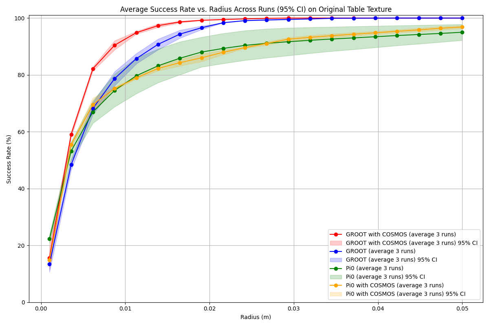
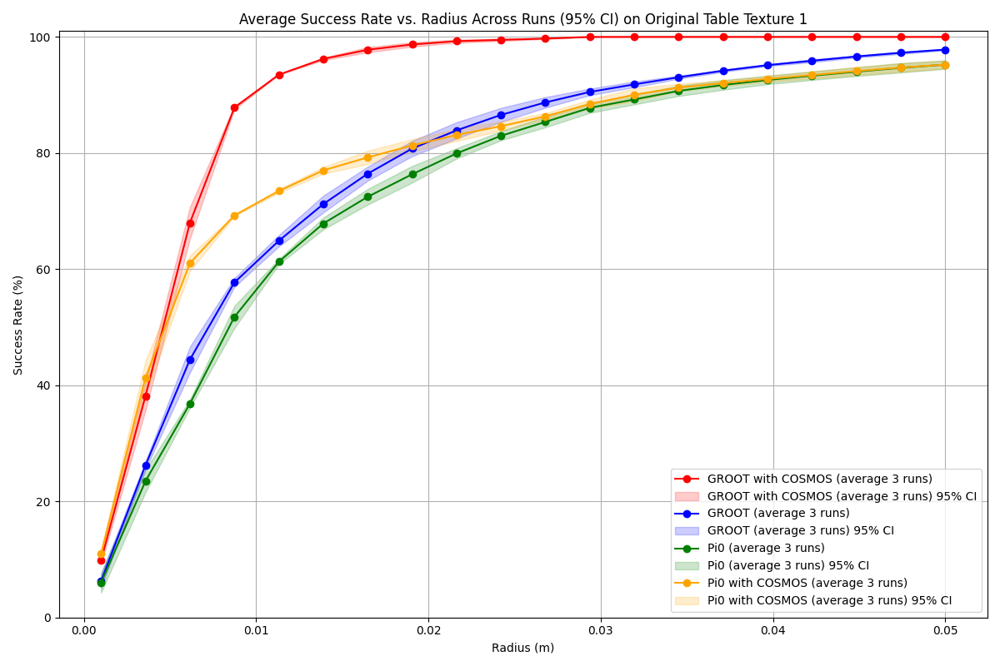
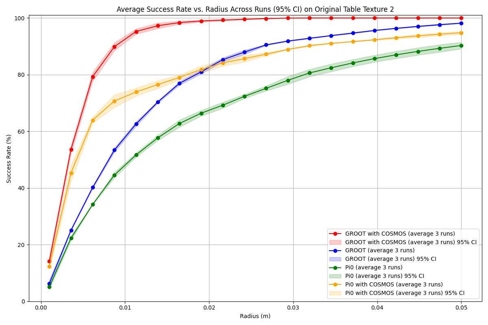
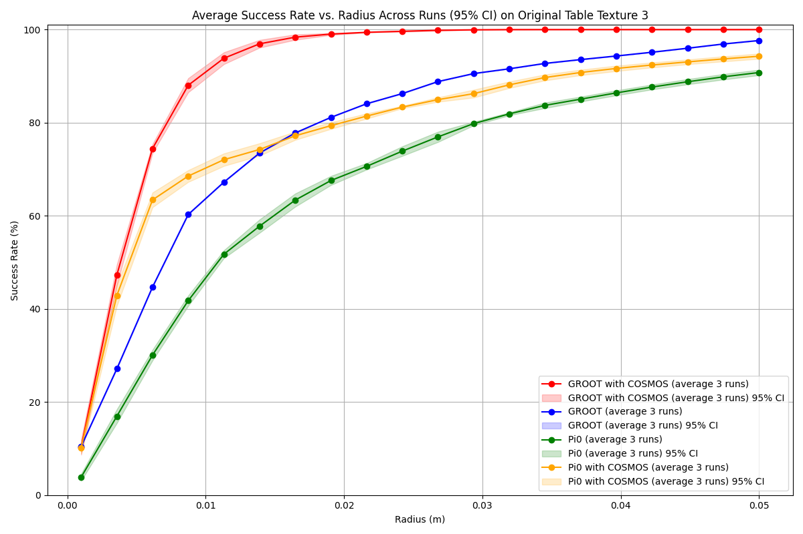
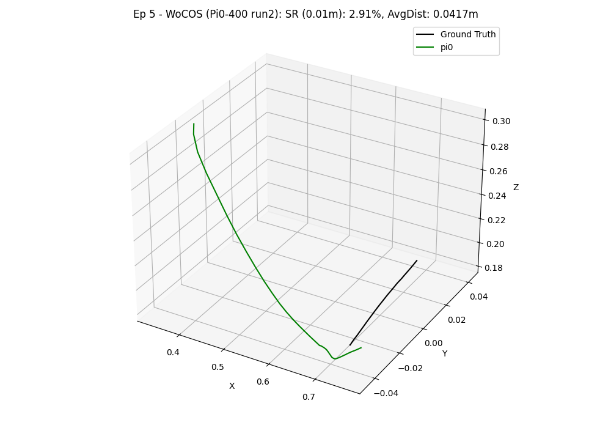
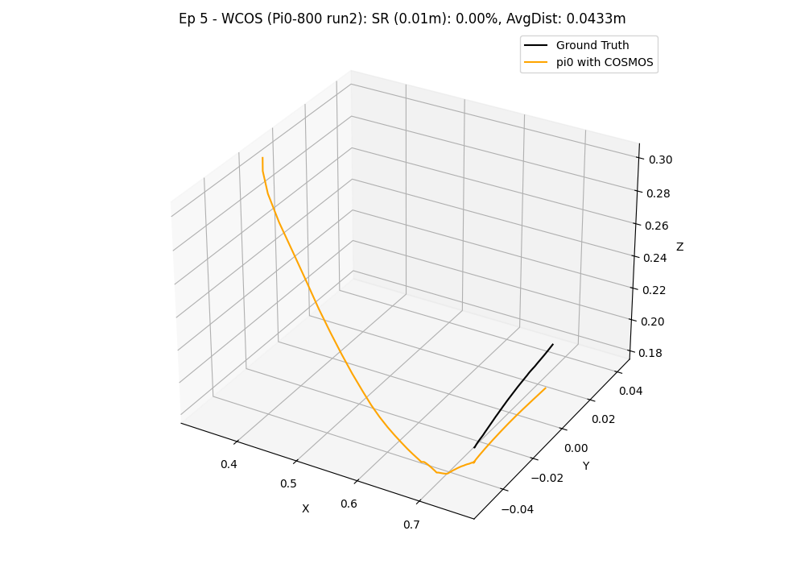
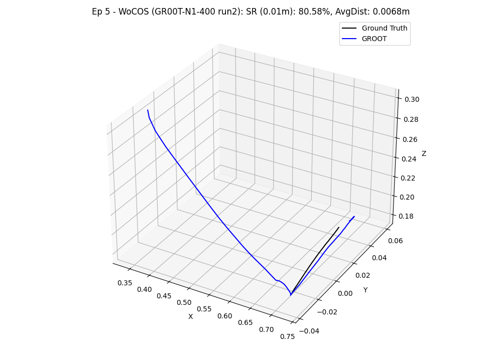
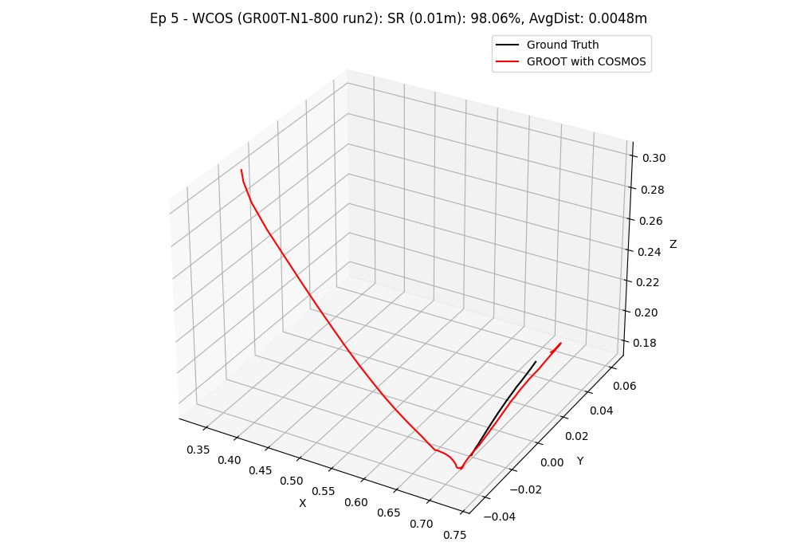

# Trajectory Evaluation

After running simulations and collecting predicted trajectories (e.g., using `sim_with_dds.py` with the `--hdf5_path` and `--npz_prefix` arguments), you can use the `evaluate_trajectories.py` script to compare these predictions against ground truth trajectories.

This script is located at `workflows/robotic_ultrasound/scripts/simulation/evaluation/evaluate_trajectories.py`.

## Overview

The script performs the following main functions:

1.  **Loads Data**: Reads ground truth trajectories from HDF5 files (e.g., `data_{e}.hdf5`) and predicted trajectories from `.npz` files based on configured file patterns.
2.  **Computes Metrics**: For each episode and each prediction source, it calculates:
    *   **Success Rate**: The percentage of ground truth points that are within a specified radius of any point in the predicted trajectory.
    *   **Average Minimum Distance**: The average distance from each ground truth point to its nearest neighbor in the predicted trajectory.
3.  **Generates Plots and Outputs**:
    *   Console output summarizing progress and final average metrics per method.
    *   Individual 3D trajectory plots comparing the ground truth and a specific prediction for each episode.
    *   A summary plot showing the mean success rate versus different radius, including 95% confidence intervals, comparing all configured prediction methods.

## Usage

Navigate to the `scripts/simulation/evaluation/` folder (or ensure your PYTHONPATH is set correctly if running from elsewhere) and execute:

```sh
python evaluate_trajectories.py \
    --data_root /path/to/your/data_and_predictions \
    --method-name WCOS --ps-file-pattern "800/pi0_robot_obs_{e}.npz" --ps-label "With COSMOS" --ps-color "red" \
    --method-name WOCOS --ps-file-pattern "400/pi0_robot_obs_{e}.npz" --ps-label "Without COSMOS" --ps-color "green" \
    --radius_for_plots 0.01 \
    --radius_to_test "0.001,0.05,20" \
    --saved_compare_name "comparison_success_rate_vs_radius.png"
```
*Adjust `data_root` and other parameters as needed.*

## Configuration

The script is primarily configured via command-line arguments. If prediction sources are not specified via the command line, it falls back to a default set defined within the script.

Key Command-Line Arguments:

| Argument             | Type      | Default                                  | Description                                                                                                                               |
|----------------------|-----------|------------------------------------------|-------------------------------------------------------------------------------------------------------------------------------------------|
| `--episode`          | int       | None                                     | Number of episodes to process. If None, it processes all episodes found in `data_root` (based on `.hdf5` files).                           |
| `--data_root`        | str       | `/mnt/hdd/cosmos/heldout-test50`         | Root directory for HDF5 ground truth files (e.g., `data_{e}.hdf5`) and predicted `.npz` trajectory files.                               |
| `--radius_for_plots` | float     | `0.01`                                   | Radius (in meters) used for calculating success rate in individual 3D trajectory plot titles.                                             |
| `--radius_to_test`   | str       | `"(0.001,0.05,20)"`                      | Comma-separated string `"(start,end,num_points)"` for the success rate vs. radius plot (e.g., `"0.001,0.05,20"`).                         |
| `--saved_compare_name`| str       | `comparison_success_rate_vs_radius.png`| Filename for the summary plot (success rate vs. radius).                                                                                  |
| `--method-name`      | str       | (appendable)                             | Name/key for a prediction source (e.g., `WCOS`). Specify once for each source you want to evaluate.                                         |
| `--ps-file-pattern`  | str       | (appendable)                             | File pattern for a prediction source's `.npz` files (e.g., `"my_model/pred_{e}.npz"`). `{e}` is replaced by episode number. Must match order of `--method-name`. |
| `--ps-label`         | str       | (appendable)                             | Label for a prediction source (for plots). Must match order of `--method-name`.                                                             |
| `--ps-color`         | str       | (appendable)                             | Color for a prediction source (for plots). Must match order of `--method-name`.                                                             |

**Defining Prediction Sources via CLI (Recommended):**

To evaluate one or more prediction methods, provide their details using the `--method-name`, `--ps-file-pattern`, `--ps-label`, and `--ps-color` arguments. Each of these arguments should be used once for each method you want to compare. For example, to compare two methods "MethodA" and "MethodB":

```sh
python evaluate_trajectories.py \
    --method-name MethodA --ps-file-pattern "path/to/methodA/results_{e}.npz" --ps-label "Method A Results" --ps-color "blue" \
    --method-name MethodB --ps-file-pattern "path/to/methodB/results_{e}.npz" --ps-label "Method B Results" --ps-color "green" \
    # ... other arguments like --data_root, --episode etc.
```

**Default Prediction Sources:**

If no prediction source arguments (`--method-name`, etc.) are provided via the command line, the script will use a predefined default set of prediction sources hardcoded in the `evaluate_trajectories.py` file. This typically includes methods like "WCOS" and "WOCOS".

The script expects predicted trajectory files to be found at `data_root/file_pattern`.

## Understanding the Outputs & Experiment Results Comparison

The `evaluate_trajectories.py` script generates several outputs to help you assess the performance of trajectory prediction methods. Below is a description of these outputs, along with an example showcasing a comparison between Pi0 and GR00T-N1 models.

### Console Output
   - **Progress**: Prints status messages indicating the current episode being processed for each method.
   - **Individual Episode Metrics**: For each episode and each prediction method, it prints the calculated Success Rate (SR) at the `radius_for_plots` and the Average Minimum Distance (AvgMinDist).
     ```
       WCOS - Ep 0: SR (0.01m) = 75.20%, AvgMinDist = 0.0085m
     ```
   - **Overall Summary**: At the end, it prints the mean Success Rate and mean Average Minimum Distance for each method, averaged over all processed episodes.
     ```
     --- Overall Summary (using radius= 0.01 m) ---
     Method: WCOS
       Avg Success Rate: 78.50%
       Avg Min Distance: 0.0075m
     Method: WOCOS
       Avg Success Rate: 72.30%
       Avg Min Distance: 0.0092m
     ```

### Example Evaluation Table

In our experiments, we utilized the `liver_scan_sm.py` script to collect an initial dataset of 400 raw trajectories. This dataset was then augmented using the Cosmos-transfer1 model to generate an additional 400 trajectories with diverse visual appearances (1:1 ratio with raw data), effectively creating a combined dataset for training and evaluation. The following table presents a comparison of success rates (at a 0.01m radius) for different policy models (Pi0 and GR00T-N1 variants) evaluated under various texture conditions in the simulated environment.
Our model was tested on both the original texture and several unseen textures. To enable these additional textures for testing, uncomment the `table_texture_randomizer` setting within the [environment configuration file](exts/robotic_us_ext/robotic_us_ext/tasks/ultrasound/approach/config/franka/franka_manager_rl_env_cfg.py).

**Evaluation Table: Success Rates (%) (@0.01m)**

| Model                                 | Original Texture | Texture 1 (Stainless Steel) | Texture 2 (Bamboo Wood) | Texture 3 (Walnut Wood) |
|---------------------------------------|------------------|-----------------------------|-------------------------|-------------------------|
| Pi0-400                               | 77.1             | 57.3                        | 47.7                    | 55.7                    |
| Pi0-800 (w/ cosmos)                   | 77.0             | 71.7                        | 72.4                    | 70.5                    |
| GR00T-N1-400                          | 84.1             | 61.5                       | 58.3                    | 64.0                   |
| GR00T-N1-800 (w/ cosmos)              | 92.8                | 91.1                           | 92.8                       | 91.7                       |

### Success Rate vs. Radius Plot
   - A plot named by the `--saved_compare_name` argument (default: `comparison_success_rate_vs_radius.png`) is saved in the `data_root` directory.
   - This plot shows the mean success rate (y-axis) as a function of the test radius (x-axis) for all configured prediction methods.
   - It includes 95% confidence interval bands for each method.

| Original Texture | Texture 1 (Stainless Steel) | Texture 2 (Bamboo Wood) | Texture 3 (Walnut Wood) |
|------------------|-----------------------------|-------------------------|-------------------------|
|  |  |  |  |

The plots visually represent these comparisons, where different models are typically color-coded (e.g., Green for the original Pi0 model, Red for Pi0 with Cosmos-transfer, Blue for the original GR00T-N1 model, and Yellow for GR00T-N1 with Cosmos-transfer). The x-axis represents the tolerance radius in meters, and the y-axis shows the corresponding mean success rate. The shaded areas around the lines indicate the 95% confidence intervals, providing a measure of result variability.

### 3D Trajectory Plots
   - For each episode and each prediction method, a 3D plot is generated and saved.
   - The path for these plots is typically `data_root/METHOD_NAME/3d_trajectories-{episode_number}.png`.
   - These plots visually compare the ground truth trajectory against the predicted trajectory.
   - The title of each plot includes the episode number, method name, success rate at `radius_for_plots`, and average minimum distance.

   **Example 3D Trajectory Visualizations:**
   To provide a qualitative view, example 3D trajectory visualizations from a selected episode (e.g., episode 14) are presented below for each model.

 | Pi0-400 | Pi0-800 (w/ cosmos) | GR00T-N1-400  | GR00T-N1-800 (w/ cosmos) |
 |------------------|-----------------------------|-------------------------|-------------------------|
 |  |      |    |      |

In these visualizations, the ground truth trajectory (derived from the 'scan' state) is depicted in black, while the colored line represents the predicted trajectory from the model.

### Key Observations and Conclusion

The evaluation results highlight several important findings:

*   **Impact of Cosmos-transfer:** Augmenting the training dataset with Cosmos-transfer (as seen in Pi0-800 and GR00T-N1-800 models) consistently and significantly improves the policy's success rate and robustness to diverse visual textures compared to models trained on original data alone (Pi0-400 and GR00T-N1-400). For instance, GR00T-N1-800 (w/ cosmos) maintains a success rate above 90% across all tested textures, a substantial improvement over GR00T-N1-400 which sees a performance drop on some textures.
*   **Model Comparison:** The GR00T-N1 architecture generally outperforms the Pi0 architecture. The GR00T-N1-800 model, benefiting from both the advanced architecture and cosmos augmented data, demonstrates the highest overall performance and consistency according to the provided data.
*   **Performance under Texture Variation:** Models trained without sufficient diverse data (e.g., Pi0-400, GR00T-N1-400) exhibit a noticeable degradation in performance when encountering textures different from the original training environment. Cosmos-transfer effectively mitigates this issue.
*   **Success Rate vs. Radius Insights:** The success rate vs. radius plots are expected to further substantiate these findings. Models enhanced by Cosmos-transfer (notably GR00T-N1-800, potentially depicted by a yellow line as per the convention mentioned) would likely maintain higher success rates even at stricter (smaller) radius, indicating greater precision. Their 95% confidence intervals also provide insight into the stability of these performance gains.

These observations underscore the value of diverse, augmented datasets like those generated by Cosmos-transfer for training robust robotic policies, particularly for tasks involving visual perception in variable environments. The GR00T-N1 model, when combined with such data augmentation, shows promising results for reliable trajectory execution.
