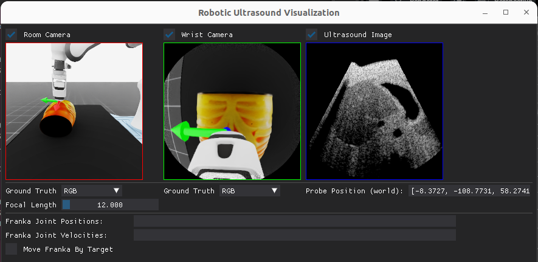

This folder contains utility tools for the robotic ultrasound task.

1. Install the dependencies.

```bash
pip install dearpygui
```

2. Run the `visualization` tool.

```bash
python utils/visualization.py
```

This will open a GUI that displays multiple real-time feeds:
- Room camera view
- Wrist camera view
- Ultrasound image with probe position information


