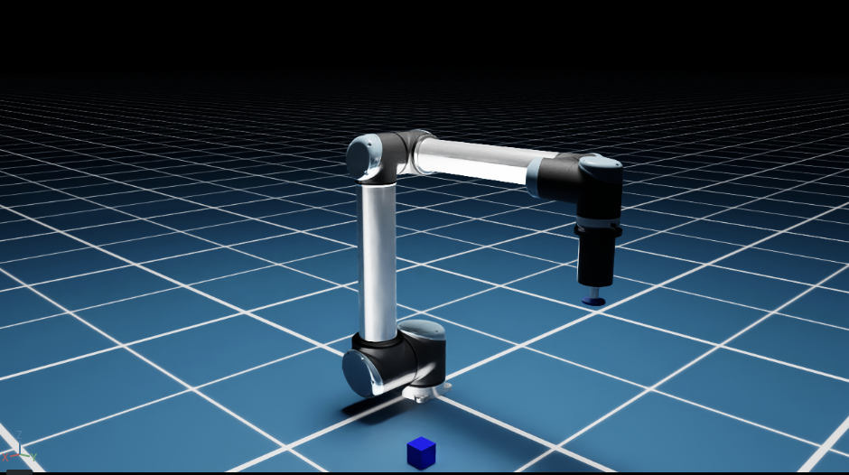

# Telesurgery



## System Requirements

- Ubuntu 22.04
- NVIDIA GPU with compute capability 8.6 and 32GB of memory
    - GPUs without RT Cores (A100, H100) are not supported.
- NVIDIA Driver Version >= 535
- 50GB of disk space
- Docker & NVIDIA Container Toolkit
- RTI license file
  - Install the license file in `~/rti_license.dat`, or
  - set the `RTI_LICENSE_FILE` environment variable
- VS Code or Cursor AI with devcontainer

## Development

### Directory Structure

```
├── build           # build output
│   ├── CMakeFiles
│   ├── _deps
│   ├── operators   # Compiled C++ operators and generated DDS structures
│   ├── patient
│   ├── python      # Generated Python bindings and DDS structures
│   ├── surgeon
│   └── Testing
├── cmake           # CMake helpers
├── deploy          # Dockerfile and patches.
│   └── hsdk        # Missing files from HSDK 3.2
├── operators       # Holoscan Operators
│   ├── data_bridge
│   └── dds
├── patient         # Patient application
│   └── simulation  #   Simulation
└── surgeon         # Surgeon application
```

### DevContainer

Use `./run vscode` to start a new VS Code or Cursor window for development.

### Running the Application

To run the applications, you may either use Dev Container or use the development container.

Use the following command to enter the development container:

```bash
./run enter
```

### Surgeon App (Leader Side)

To run the Surgeon application:

```bash
./run surgeon [--rebuild]
```

The Surgeon application, by default, is configured to simulate and emit joystick events.
To use a physical joystick, you must edit the following files:

- [surgeon.yaml](./surgeon/surgeon.yaml) configuration file, under `hid > hid_devices`.
- DevContainer: [devcontainer.json](.devcontainer/devcontainer.json) file and uncomment the line `"--device=/dev/input/js0"`.
- For the `./run enter' command, edit the 'enter()' in the [run](./run) script.

### Patient App (Follower Side)

To run the Patient application:

```bash
./run patient [--rebuild]
```
