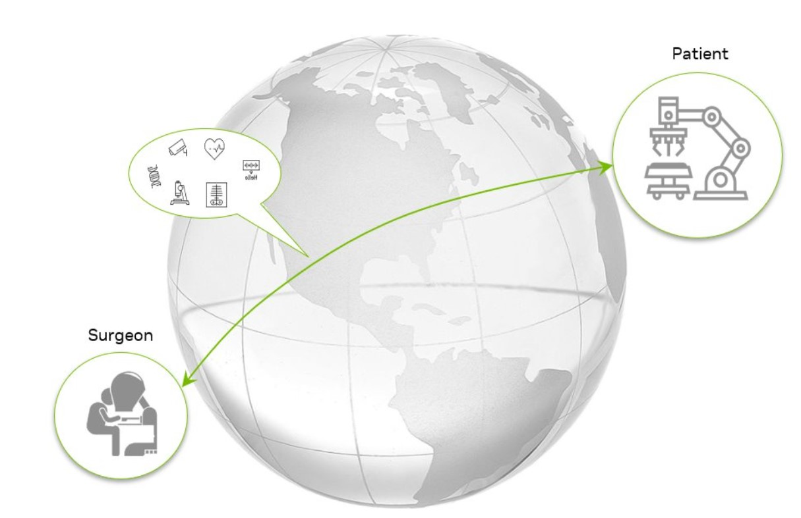
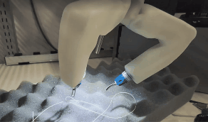
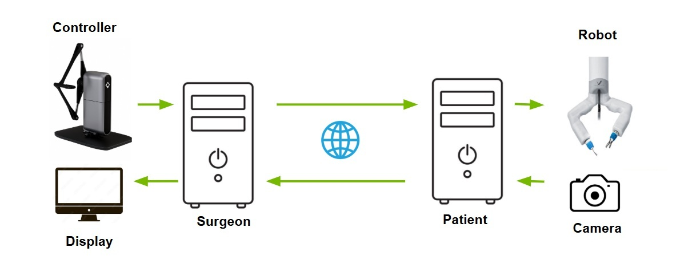
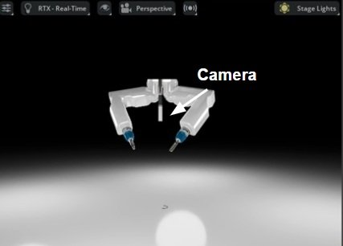
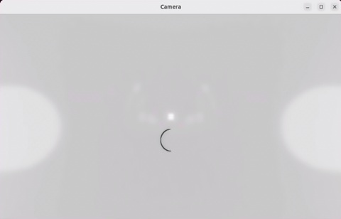

# 🌐 Telesurgery Workflow



---

## 🔬 Technical Overview

The Telesurgery Workflow is a cutting-edge solution designed for healthcare professionals and researchers working in the field of remote surgical procedures. This workflow provides a comprehensive framework for enabling and analyzing remote surgical operations, leveraging NVIDIA's advanced GPU capabilities to ensure real-time, high-fidelity surgical interactions across distances. It enables surgeons to perform complex procedures remotely, researchers to develop new telemedicine techniques, and medical institutions to expand their reach to underserved areas. By offering a robust platform for remote surgical operations, this workflow helps improve healthcare accessibility, reduce geographical barriers to specialized care, and advance the field of telemedicine.

### Demos

The following GIFs demonstrate the real-world telesurgery workflow performing benchtop tasks:
<p align="middle">
  
  
  
</p>

- Left: Teleoperation of the MIRA robot using the Haply Inverse3 across San Francisco (surgeon) and Santa Clara (robot)
- Center: Suturing task in progress
- Right: Cutting task using a scissor tool

### System Architecture

The telesurgery workflow presented here can be conceptually summarized by the following diagram.



- <b>Surgeon Side</b>: Includes the controller and display connected to the workstation.
- <b>Patient Side</b>: Includes the surgical robot and camera. In real-world workflows, both are physical devices. In simulation, they are virtual.

The surgeon uses the controller to operate the robot remotely. The robot’s actions and environment are captured by a camera and streamed back via DDS to the surgeon’s display in real-time.

### Controllers

Two types of controllers are supported:

- A Microsoft Xbox or compatible controller
- A Haply Inverse3 device for advanced, intuitive control of the robot (not yet fully supported in simulation)

> [!Note]
> In simulation mode, use the Xbox controller. Haply Inverse3 support is still under development.

### Robots

This workflow supports the [MIRA robot](https://virtualincision.com/mira/) from Virtual Incision in simulation and in the physical world.

### Cameras

#### Simulation
For the simulation workflow, there is a virtual camera that is located on the MIRA robot between the left and right arms.




#### Real World
In the real world workflow, two camera types are currently supported

- Intel RealSense camera (can stream depth instead if supported by camera)
- cv2-compatible camera such as USB webcams

Future support: NVIDIA Holoscan Sensor Bridge (HSB) for low-latency video streaming.

### Displays

Any display can be used, but for minimal latency, a G-Sync enabled monitor with high refresh rate (e.g., 240Hz) is recommended.

### Machines

The surgeon and patient workstations can be x86_64 Ubuntu systems or IGX devkits. While they may run on the same machine, they are typically separate systems and can be located far apart.

> [!Note]
> Isaac Sim does not support arm64. The patient system must be x86_64 when running simulation workflows.

### Communication

Below describes the communication systems used between the surgeon and patient machines.

- <b>Control</b>: WebSockets transmit commands from surgeon to robot
- <b>Video</b>: DDS streams camera output from patient to surgeon

Prior to running, configure the `SURGEON_IP` and `PATIENT_IP` as shown [here](#2-environment-configuration).
The video is encoded (default: NVIDIA Video Codec), and parameters like bitrate and codec are [configurable](#advanced-nvidia-video-codec-configuration).

---

## 📋 Table of Contents

- [Telesurgery Workflow](#-telesurgery-workflow)
  - [🔍 Prerequisites](#-prerequisites)
    - [System Requirements](#system-requirements)
    - [Common Setup](#common-setup)
  - [⚡ Running Workflows](#-running-workflows)
    - [Real World Environment](#real-world-environment)
    - [Simulation Environment](#simulation-environment)
  - [🔧 Advanced Configuration](#-advanced-configuration)
    - [NTP Server Setup](#ntp-server-setup)
    - [NVIDIA Video Codec Configuration](#advanced-nvidia-video-codec-configuration)
  - [🛠️ Troubleshooting](#-troubleshooting)
    - [Common Issues](#common-issues)
  - [📄 Licensing](#-licensing)

---

## 🔍 Prerequisites

### System Requirements

#### Hardware Requirements
- Ubuntu >= 22.04
- NVIDIA GPU with compute capability 8.6 and 24GB of memory ([see NVIDIA's compute capability guide](https://developer.nvidia.com/cuda-gpus#compute))
   - GPUs without RT Cores, such as A100 and H100, are not supported
- 50GB of disk space
- **XBOX Controller** or **Haply Inverse 3**
- **MIRA** robot (if running the physical workflow)

#### Software Requirements

Most of the software requirements below are met by following the [workflow instructions](#-running-workflows).
For the Docker version and NVIDIA driver version, follow the links below to upgrade.  For upgrading the NVIDIA driver version on an IGX, follow the instructions
 [here](#update-cuda-driver-on-igx).

- [NVIDIA Driver Version >= 570](https://developer.nvidia.com/cuda-downloads)
- [CUDA Version >= 12.8](https://developer.nvidia.com/cuda-downloads)
- Python 3.10
- [Docker](https://docs.docker.com/engine/install/) 28.0.4+
- [NVIDIA Container Toolkit](https://docs.nvidia.com/datacenter/cloud-native/container-toolkit/latest/install-guide.html) 1.17.5+

#### Communication Middleware
- **RTI Connext Data Distribution Service (DDS)**: Professional or evaluation license ([obtain here](https://www.rti.com/free-trial))

### Common Setup

#### 1️⃣ RTI DDS License Setup
```bash
export RTI_LICENSE_FILE=<full-path-to-rti-license-file>
# for example
export RTI_LICENSE_FILE=/home/username/rti/rti_license.dat
```

> [!Note]
> RTI DDS is the common communication package for all scripts. Please refer to [DDS website](https://www.rti.com/products) for registration. You will need to obtain a license file and set the `RTI_LICENSE_FILE` environment variable to its path.

#### 2️⃣ Environment Configuration
When running the Patient and the Surgeon applications on separate systems, export the following environment variables:

```bash
# Set IP addresses of patient and surgeon machines
export PATIENT_IP="<IP Address of the system running the Patient application>"
export SURGEON_IP="<IP Address of the system running the Surgeon application>"

# Export the following for NTP Server (Optional)
export NTP_SERVER_HOST="<IP Address of the NTP Server>"
export NTP_SERVER_PORT="123"
```

> [!Note]
> For NTP settings and variables, refer to the [NTP (Network Time Protocol) Server](#ntp-server-setup) section for additional details.

---

## ⚡ Running Workflows

### Real World Environment

The real world workflow requires a MIRA robot from Virtual Incision.  Once the MIRA robot is up and running, there is an API
daemon service that will listen in the background for commands sent from the surgeon controller application.  The robot is not
necessary if you only want to test the video streaming functionality.

For the camera(s) on the patient side, you can plug a Realsense camera or a USB webcam to the patient's workstation
and place it in the desired location.  The MIRA robot also comes with a camera, and you can interface with it by using an HDMI capture
card, or HDMI to USB-C capture card.

#### 1️⃣ Build Environment
```bash
git clone https://github.com/isaac-for-healthcare/i4h-workflows.git
cd i4h-workflows
workflows/telesurgery/docker/real.sh build
```

#### 2️⃣ Running Applications

##### Patient Application
```bash
# Start the Docker Container
workflows/telesurgery/docker/real.sh run

# Getting video from the camera
python patient/physical/camera.py --camera [realsense|cv2] --name robot --width 1280 --height 720
```

##### Surgeon Application

There are two applications to start on the surgeon side
- <b>Viewer</b>: `surgeon/viewer.py` starts the application to receive video stream from the robot's camera
- <b>Controller</b>: `surgeon/gamepad.py` or `surgeon/haply.py` starts the application to allow the surgeon to control the robot

Each application is started independently, and allows multiple surgeons/users to connect to the robot's camera
while one surgeon may have control of the robot.

Run the following to receive video stream from the robot camera:
```bash
# Start the Docker Container
workflows/telesurgery/docker/real.sh run

# Start the Surgeon Viewer Application
python surgeon/viewer.py --name robot --width 1280 --height 720 2> /dev/null
```

Run the following to control the robot using a game controller:
```bash
# Start the Docker Container
workflows/telesurgery/docker/real.sh run

# Run the Gamepad Controller Application
python surgeon/gamepad.py --api_host ${PATIENT_IP} --api_port 8081
```

Or run the following to control the robot using Haply Inverse3:
```bash
# Start the Docker Container
workflows/telesurgery/docker/real.sh run

# Run the Gamepad Controller Application
python surgeon/haply.py --api_host ${PATIENT_IP} --api_port 8081
```

### Simulation Environment

The simulation workflow runs Isaac Sim on the patient side to simulate and control the robot in a physics-based environment, enabling development, testing, and validation of robot behaviors in realistic scenarios.  In the scene, there is a MIRA robot with a camera located between its left and right arms (see [image](#simulation)).  The video that is streamed over to the surgeon application comes from this camera i.e., the surgeon will only see what is visible from this camera's perspective.

> [!Note]
> Allow the patient application to fully initialize before starting the surgeon’s viewer to avoid delays, otherwise the viewer application may appear to hang while waiting for a video stream.

#### 1️⃣ Build Environment
```bash
git clone https://github.com/isaac-for-healthcare/i4h-workflows.git
cd i4h-workflows
workflows/telesurgery/docker/sim.sh build
```

#### 2️⃣ Running Applications

##### Patient Application
```bash
# Start the Docker Container
workflows/telesurgery/docker/sim.sh run

# Start the Patient Application
python patient/simulation/main.py
```

**Expected Behavior:**
- The initial view displayed in Isaac Sim is a suture needle on top of a white, reflective surface.
- To understand the elements in the scene (e.g. the MIRA robot), you can customize the viewport `Camera` to `Perspective` or `Top` view.


> [!Note]
> While Isaac Sim is loading, you may see the message "Isaac Sim is not responding". It can take approximately several minutes to download the assets and models from the internet and load them to the scene. If this is the first time you run the workflow, it can take up to 10 minutes.

##### Surgeon Application

There are two applications to start on the surgeon side
- <b>Viewer</b>: `surgeon/viewer.py` starts the application to receive video stream from the robot's camera
- <b>Controller</b>: `surgeon/gamepad.py` starts the application to allow the surgeon to control the robot

Each application is started independently, and allows multiple surgeons/users to connect to the robot's camera
while one surgeon may have control of the robot.

Run the following to receive video stream from the robot camera:
```bash
# Start the Docker Container
workflows/telesurgery/docker/sim.sh run

# Start the Surgeon Viewer Application
python surgeon/viewer.py --name robot --width 1280 --height 720 2> /dev/null
```

**Expected Behavior:**
- The surgeon sees only what is visible from the camera located on the MIRA robot and does not have access to other views
- In the initial scene, a suture needle on a white, reflective surface will be visible from the robot camera as shown below



Run the following to control the robot:
```bash
# Start the Docker Container
workflows/telesurgery/docker/sim.sh run

# Run the Gamepad Controller Application
python surgeon/gamepad.py --api_host ${PATIENT_IP} --api_port 8081
```

See [keybindings](./docs/gamepad.md) for how to use the game controller.

---

## 🔧 Advanced Configuration

### NTP Server Setup
An NTP (Network Time Protocol) server provides accurate time information to clients over a computer network. NTP is designed to synchronize the clocks of computers to a reference time source, ensuring all devices on the network maintain the same time.

```bash
# Run your own NTP server in the background
docker run -d --name ntp-server --restart=always -p 123:123/udp cturra/ntp

# Check if it's running
docker logs ntp-server

# fix server ip in env.sh for NTP Server
export NTP_SERVER_HOST=<NTP server address>

# To stop the server
docker stop ntp-server && docker rm ntp-server
```

### Advanced NVIDIA Video Codec Configuration

The applications streams H.264 by default using NVIDIA Video Codec. Additional encoding parameters can be customized in the Patient application using the `--encoder_params` argument:

```bash
python patient/simulation/main.py --encoder nvc --encoder_params patient/nvc_encoder_params.json
```

#### Sample Encoding Parameters

Here's an example of encoding parameters in JSON format:

```json
{
    "codec": "H264", // Possible values: H264 or HEVC
    "preset": "P3", // Options include P3, P4, P5, P6, P7
    "bitrate": 10000000,
    "frame_rate": 60,
    "rate_control_mode": 1, // Options: 0 for Constant QP, 1 for Variable bitrate, 2 for Constant bitrate
    "multi_pass_encoding": 0 // Options: 0 to disable, 1 for Quarter resolution, 2 for Full resolution
}
```

### Advanced NVJPEG Configuration

Adjust the quality of encoded frames using the NVJPEG encoder by editing the [nvjpeg_encoder_params.json](./scripts/patient/nvjpeg_encoder_params.json) file. Simply change the quality parameter to a value between 1 and 100:

```json
{
    "quality": 90
}
```

---

## 🛠️ Troubleshooting

### Common Issues

#### Docker Build Error "empty ssh agent socket"
Q: I get the following error when building the Docker image:
```bash
ERROR: invalid empty ssh agent socket: make sure SSH_AUTH_SOCK is set
```

A: Start the ssh-agent
```bash
eval "$(ssh-agent -s)" && ssh-add
```

#### Docker Build Error "Permission denied (publickey)"
Q: I get the following error when building the Docker image when cloning i4h-asset-catalog
```
 => ERROR [stage-0  7/12] RUN --mount=type=ssh     /workspace/isaaclab/_isaac_sim/python.sh -m pip install --no-deps         git+ssh://git@github.com/isaac-for-healthcare/i4h-asset-ca  1.6s
0.793 Collecting git+ssh://****@github.com/isaac-for-healthcare/i4h-asset-catalog.git@main
0.793   Cloning ssh://****@github.com/isaac-for-healthcare/i4h-asset-catalog.git (to revision main) to ./pip-req-build-_jfynqqa
0.801   Running command git clone --filter=blob:none --quiet 'ssh://****@github.com/isaac-for-healthcare/i4h-asset-catalog.git' /tmp/pip-req-build-_jfynqqa
1.334   git@github.com: Permission denied (publickey).
1.335   fatal: Could not read from remote repository.
```

A: Make sure you've added your ssh key using ssh-add. If the error persist, try adding a new ssh key to your GitHub account and ensure
single sign on is configured for isaac-for-healthcare.

#### Unable to launch the applications when using NVIDIA Video Codec

Q: I'm getting an error when I start the application with the NVIDIA Video Codec.

```BASH
[error] [nv_video_encoder.cpp:101] Failed to create encoder: LoadNvEncApi : Current Driver Version does not support this NvEncodeAPI version, please upgrade driver at /workspace/holohub/build/nvidia_video_codec/_deps/nvc_sdk/NvEncoder/NvEncoder.cpp:82
```

**A:** NVIDIA Video Codec requires CUDA version 12 (driver version 570.0) or later. Check out the [NVIDIA Video Codec System Requirements](https://developer.nvidia.com/nvidia-video-codec-sdk/download) section for more details. **


#### Update CUDA Driver on IGX
```bash
# ssh to igx-host to run the following commands
sudo systemctl isolate multi-user

sudo apt purge "nvidia-kernel-*"
sudo add-apt-repository ppa:graphics-drivers/ppa
sudo apt update

sudo apt-get -y install linux-headers-nvidia-tegra aptitude
sudo aptitude install nvidia-driver-570-open # Resolve any conflicts

# hard reboot igx (soft reboot may not work)
```

---

## 📄 Licensing

By using the Telesurgery workflow and NVIDIA Video Codec, you are implicitly agreeing to the [NVIDIA Software License Agreement](https://www.nvidia.com/en-us/agreements/enterprise-software/nvidia-software-license-agreement/) and [NVIDIA Software Developer License Agreement](https://developer.download.nvidia.com/designworks/DesignWorks_SDKs_Samples_Tools_License_distrib_use_rights_2017_06_13.pdf?t=eyJscyI6InJlZiIsImxzZCI6IlJFRi1zZWFyY2guYnJhdmUuY29tLyJ9). If you do not agree to the EULA, do not run this container.
